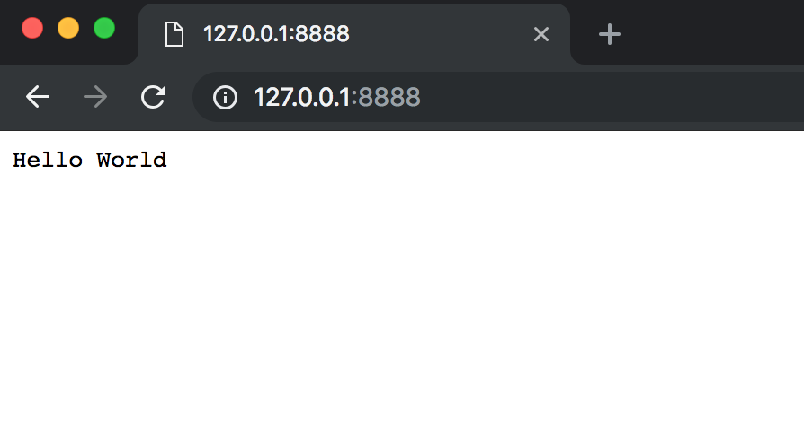

# 01-Hello World

一般计算机书的开头都是 Hello World

我们亦不能免俗，所以本章我们的任务就是完成最简单的 Hello World

_本章的GitHub链接为：_ [Source](https://github.com/bonfy/go-mega-code/tree/01-Hello-World), [Zip](https://github.com/bonfy/go-mega-code/archive/v0.1.zip)

## 建立目录结构

与 Python 相比，Go 对代码存放的位置还是有讲究的，毕竟这是由 Go 特殊的 `package引用机制` 决定的，首先建立自己存放这次代码的文件夹

```cmd
$ cd $GOPATH/src
$ mkdir -p github.com/bonfy/go-mega-code
$ cd github.com/bonfy/go-mega-code
```

这里如果大家有Github账号，而且想上传到自己的repo的话，建议 github.com/your\_user\_name/repo\_name 的文件夹

## Hello World 应用

在 github.com/bonfy/go-mega-code 文件夹下 建立 `main.go`，这是我们程序的主入口

`main.go`

```go
package main

import "net/http"

func main() {
    http.HandleFunc("/", func(w http.ResponseWriter, r *http.Request) {
        w.Write([]byte("Hello World"))
    })
    http.ListenAndServe(":8888", nil)
}
```

短短不到10行代码，我们的 Hello World 应用就已经完成了，而且不需要任何的其他第三方Package，只需要引入官方的 _**net/http**_ 就行了，就是这么easy

让我们来运行下面的命令，看下效果

```cmd
$ go run main.go
```

现在打开您的网络浏览器并在地址栏中输入以下URL：

```
http://localhost:8888

或者

http://127.0.0.1:8888
```



## 说明

这里对上面的代码进行简单的说明

这里的 `func main()` 是主程序入口，主要用到了 _**net/http**_ 的两个函数

```go
func HandleFunc(pattern string, handler func(ResponseWriter, *Request))

func ListenAndServe(addr string, handler Handler) error
```

`HandleFunc` 类似于 flask的 `app.route`, `pattern` 提供了路由路径，handler是一个函数参数，这里我们的程序中传入的是一个匿名函数， 减少了代码

`ListenAndServe` 第一个参数为 addr，如果不提供ip，这里只传入端口，相当于 `0.0.0.0:8888` ，第二个参数 Handler 传入 nil，则表示使用 Default 的 Server

另外 输出　`Hello World` 的办法，大致有三个，如下:

```go
// Case 1: w.Write byte
w.Write([]byte("Hello World"))

// Case 2: fmt.Fprintf
fmt.Fprintf(w, "Hello World")

// Case 3: io.Write
io.WriteString(w, "Hello World")
```

其中第一种用的是 ResponseWriter 的 `Write([]byte) (int, error)` 方法， 而 后面两种是稍微用到了 Go 里面interface 的特性， ResponseWriter interface 要实现 `Write([]byte) (int, error)` 的方法，所以也就实现了 io.Writer 方法，所以可以作为 io.Writer 的类型作为 后面两个函数的参数。

这里如果想更深入的了解 net/http 处理请求的话，可以看下Go源码中的 `net/http/server.go`

或者看下 [Go的http包详解](https://github.com/astaxie/build-web-application-with-golang/blob/master/zh/03.4.md)

## Links

  * [目录](README.md)
  * 上一节: [00-Prepare](00-prepare.md)
  * 下一节: [02-Template-Basic](02-template-basic.md)
