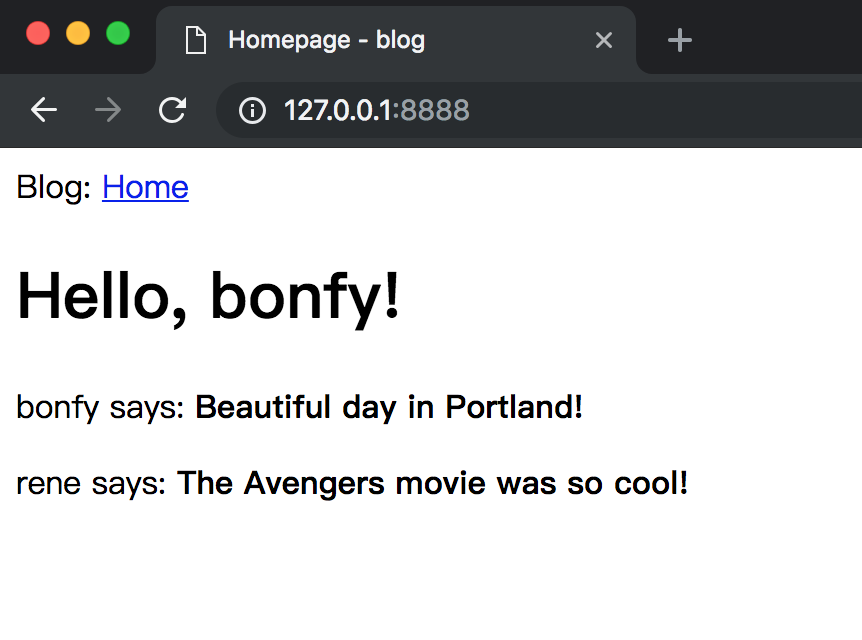

# 03-Template Advance

学习完 [第二章](02-template-basic.md) 之后，你对模板已经有了基本的认识

本章将讨论 Go 的组合特性，以及 建立一个通用的调用 模板的方法

_本章的GitHub链接为：_ [Source](https://github.com/bonfy/go-mega-code/tree/03-Template-Advance), [Diff](https://github.com/bonfy/go-mega-code/compare/02-Template...03-Template-Advance), 
[Zip](https://github.com/bonfy/go-mega-code/archive/v0.3.zip)

## 匿名组合

`匿名组合` 其实是Go里的一个非常重要的特性，在 Go 的世界里没有继承，只有组合（当然还有接口）。组合其实可以实现部分的继承。


main.go

```go
type Post struct {
    User
    Body string
}

// IndexViewModel struct
type IndexViewModel struct {
    Title string
    User
    Posts []Post
}
```

就是 将 `User User ->  User`其它都不变，这样执行，发现程序照常运行

不过，现在我们可以改下templates/index.html

templates.index.html

```html
<html>
    <head>
        {{if .Title}}
            <title>{{.Title}} - blog</title>
        {{else}}
            <title>Welcome to blog!</title>
        {{end}}
    </head>
    <body>
        <h1>Hello, {{.Username}}!</h1>
        {{range .Posts}}
            <div><p>{{ .Username }} says: <b>{{ .Body }}</b></p></div>
        {{end}}

    </body>
</html>
```

由于 `匿名组合` ，我们现在可以将 `{{.User.Username}} -> {{.Username}}`

就是我们可以直接使用 `匿名组合` 的属性，以及方法，其实也是变像的实现了继承。

关于 **Go** 的 面向对象，可以看下 [参考](https://github.com/astaxie/build-web-application-with-golang/blob/master/zh/02.5.md)

> 本小节 [Diff](https://github.com/bonfy/go-mega-code/commit/134267d02ad558c191387b79afd4b1cb8bcd1622)

## 模板继承

其实 Go 的模板应该没有 Flask jinja2 这样的功能强大，它只有 include，所以为了实现模板的继承，我们需要发挥下主观能动性

index.html

```go
package main

import (
    "html/template"
    "io/ioutil"
    "net/http"
    "os"
)

// User struct
type User struct {
    Username string
}

// Post struct
type Post struct {
    User
    Body string
}

// IndexViewModel struct
type IndexViewModel struct {
    Title string
    User
    Posts []Post
}

// PopulateTemplates func
// Create map template name to template.Template
func PopulateTemplates() map[string]*template.Template {
    const basePath = "templates"
    result := make(map[string]*template.Template)

    layout := template.Must(template.ParseFiles(basePath + "/_base.html"))
    dir, err := os.Open(basePath + "/content")
    if err != nil {
        panic("Failed to open template blocks directory: " + err.Error())
    }
    fis, err := dir.Readdir(-1)
    if err != nil {
        panic("Failed to read contents of content directory: " + err.Error())
    }
    for _, fi := range fis {
        f, err := os.Open(basePath + "/content/" + fi.Name())
        if err != nil {
            panic("Failed to open template '" + fi.Name() + "'")
        }
        content, err := ioutil.ReadAll(f)
        if err != nil {
            panic("Failed to read content from file '" + fi.Name() + "'")
        }
        f.Close()
        tmpl := template.Must(layout.Clone())
        _, err = tmpl.Parse(string(content))
        if err != nil {
            panic("Failed to parse contents of '" + fi.Name() + "' as template")
        }
        result[fi.Name()] = tmpl
    }
    return result
}

func main() {
    http.HandleFunc("/", func(w http.ResponseWriter, r *http.Request) {
        u1 := User{Username: "bonfy"}
        u2 := User{Username: "rene"}

        posts := []Post{
            Post{User: u1, Body: "Beautiful day in Portland!"},
            Post{User: u2, Body: "The Avengers movie was so cool!"},
        }

        v := IndexViewModel{Title: "Homepage", User: u1, Posts: posts}

        templates := PopulateTemplates()
        templates["index.html"].Execute(w, &v)
    })
    http.ListenAndServe(":8888", nil)
}
```

templates/\_base.html

```html
<html>
    <head>
        {{if .Title}}
        <title>{{.Title}} - blog</title>
        {{else}}
        <title>Welcome to blog!</title>
        {{end}}
    </head>
    <body>
        <div>Blog: <a href="/">Home</a></div>
        {{template "content" .}}
    </body>
</html>
```

templates/content/index.html

```html
{{define "content"}}
    <h1>Hello, {{.User.Username}}!</h1>

    {{range .Posts}}
        <div><p>{{ .User.Username }} says: <b>{{ .Body }}</b></p></div>
    {{end}}
{{end}}
```

这里用了模板继承，\_base 是 基础模板，这样 比如 head 等信息不用再重复的去在每个.html文件中重复定义，我们可以专注于每个页面的业务逻辑和内容。

由于没有像 Jinja2 这样的原生支持模板继承，这个实现的关键就是 PopulateTemplates 函数，它的作用是 遍历 templates/content/ 文件夹下的所有文件，并和 templates/\_base.html 合成 template.Template，然后再存入 map 中(在 Python 中一般叫 dict)，可以使用例如 index.html 的 key 来访问。

我们现在运行下程序，页面还是和原来一样(只是我们在 \_base template 里面加入了 Home 的导航)，不过我们的templates文件夹已经有了基础模板，并且具备了快速扩展的能力。下章 [Web Form](04-web-form.md) 我们可以看见效果。



> 本小节 [Diff](https://github.com/bonfy/go-mega-code/commit/e5fd3ef25bcc6874818621d06e68dee3d379778a)

## Links

  * [目录](README.md)
  * 上一节: [01-Hello-World](02-template-basic.md)
  * 下一节: [03-Template-Advance](04-web-form.md)
