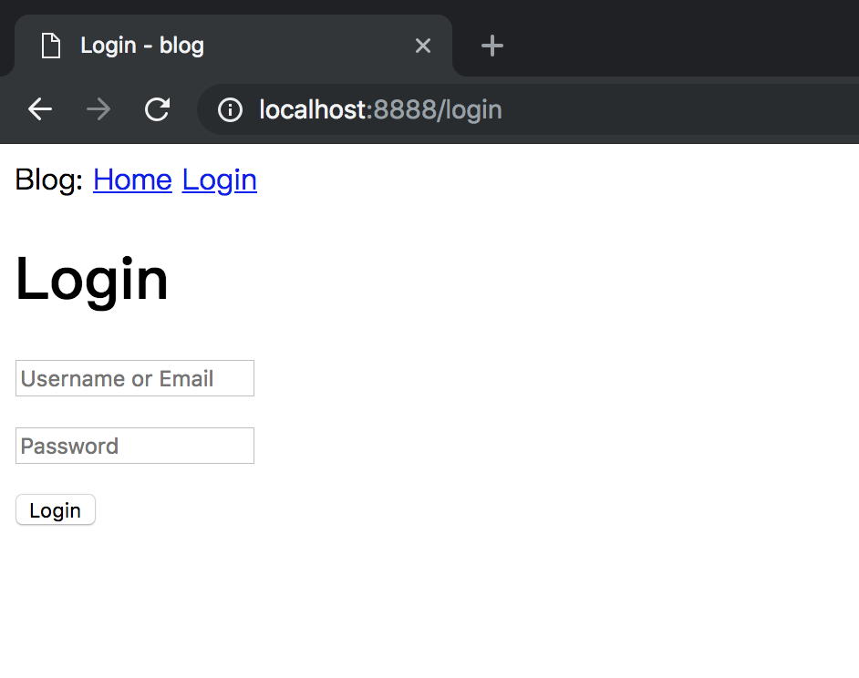
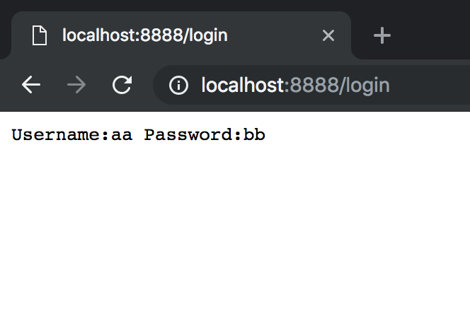
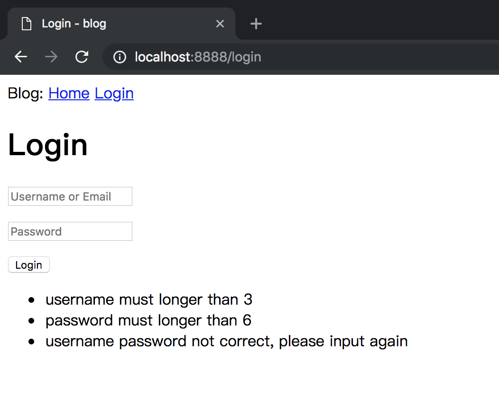

# 04-Web Form

上两章我们讨论了Template，本章节我们继续讨论 Web 表单

Web表单是所有Web应用程序中最基本的组成部分之一。 本章我们将使用表单来为用户发表动态和登录认证提供途径。

_本章的GitHub链接为_ [Source](https://github.com/bonfy/go-mega-code/tree/04-Web-Form), [Diff](https://github.com/bonfy/go-mega-code/compare/03-Template-Advance...04-Web-Form), 
[Zip](https://github.com/bonfy/go-mega-code/archive/v0.4.zip)

## 结构优化

上一章我们通过 模板继承 以及 PopulateTemplates 对 templates 文件夹进行了梳理，在继续开始Web表单之前，我们再来梳理下其中 **Go** 代码的结构。

目前我们的所有的逻辑都集中在了 `main.go` 文件里，包括 model struct， viewmodel struct 定义，还有 handler 的实现，对于小点的web应用程序，可能这有助于快速开发，不过随着项目的扩大，代码量会变得越来越多，越来越臃肿，最后甚至会影响到阅读代码。这个时候结构的优化就显得尤为重要了。

我们的思路是 建立这样的数据结构:

* package model         - 负责数据建模（以及后一章 [数据库](05-database.md) ORM）
* package vm            - 负责View Model
* package controller    - 负责 http 路由


 每个文件夹下的 g.go 负责存放该package的全局变量 以及 init 函数。（ 只能说 类似 Python 的 `__init__.py`, 因为 **Go** 其实是通过大小写来表明是否可以外部引用)

我们先建立model 文件夹，然后将 Post、User struct 分别移到 `model` 文件夹下

model/user.go

```go
package model

// User struct
type User struct {
    Username string
}
```

model/post.go

```go
package model

// Post struct
type Post struct {
    User
    Body string
}
```

再将 view model 移到 vm文件夹下

vm/g.go

```go
package vm

// BaseViewModel struct
type BaseViewModel struct {
    Title string
}

// SetTitle func
func (v *BaseViewModel) SetTitle(title string) {
    v.Title = title
}
```

由于\_base.html 基础模板中有 Title 字段，所以 Title是每个view都必有的字段，我们将它单独设成个 BaseViewStruct，方便用 `匿名组合`；


vm/index.go

```go
package vm

import "github.com/bonfy/go-mega-code/model"

// IndexViewModel struct
type IndexViewModel struct {
    BaseViewModel
    model.User
    Posts []model.Post
}

// IndexViewModelOp struct
type IndexViewModelOp struct{}

// GetVM func
func (IndexViewModelOp) GetVM() IndexViewModel {
    u1 := model.User{Username: "bonfy"}
    u2 := model.User{Username: "rene"}

    posts := []model.Post{
        model.Post{User: u1, Body: "Beautiful day in Portland!"},
        model.Post{User: u2, Body: "The Avengers movie was so cool!"},
    }

    v := IndexViewModel{BaseViewModel{Title: "Homepage"}, u1, posts}
    return v
}
```

将所有的路由相关移到controller

> `utils.go` 存放 辅助工具函数，一般都是本package引用，所以小写就可以了, 这里PopulateTemplates 函数其实最好是小写，不过不去管它了。

controller/utils.go

```go
package controller

import (
    "html/template"
    "io/ioutil"
    "os"
)

// PopulateTemplates func
// Create map template name to template.Template
func PopulateTemplates() map[string]*template.Template {
    const basePath = "templates"
    result := make(map[string]*template.Template)

    layout := template.Must(template.ParseFiles(basePath + "/_base.html"))
    dir, err := os.Open(basePath + "/content")
    if err != nil {
        panic("Failed to open template blocks directory: " + err.Error())
    }
    fis, err := dir.Readdir(-1)
    if err != nil {
        panic("Failed to read contents of content directory: " + err.Error())
    }
    for _, fi := range fis {
        f, err := os.Open(basePath + "/content/" + fi.Name())
        if err != nil {
            panic("Failed to open template '" + fi.Name() + "'")
        }
        content, err := ioutil.ReadAll(f)
        if err != nil {
            panic("Failed to read content from file '" + fi.Name() + "'")
        }
        f.Close()
        tmpl := template.Must(layout.Clone())
        _, err = tmpl.Parse(string(content))
        if err != nil {
            panic("Failed to parse contents of '" + fi.Name() + "' as template")
        }
        result[fi.Name()] = tmpl
    }
    return result
}
```

controller/g.go

```go
package controller

import "html/template"

var (
    homeController home
    templates      map[string]*template.Template
)

func init() {
    templates = PopulateTemplates()
}

// Startup func
func Startup() {
    homeController.registerRoutes()
}
```

controller/home.go

```go
package controller

import (
    "net/http"

    "github.com/bonfy/go-mega-code/vm"
)

type home struct{}

func (h home) registerRoutes() {
    http.HandleFunc("/", indexHandler)
}

func indexHandler(w http.ResponseWriter, r *http.Request) {
    vop := vm.IndexViewModelOp{}
    v := vop.GetVM()
    templates["index.html"].Execute(w, &v)
}
```

这里将 匿名函数 实名成 indexHandler，并将所有的构造 indexviewmodel 的逻辑全部移到了 `vm/index.go` 中的 GetVM 方法里

最终我们的结构优化成了下图的树状结构，这样有利于我们以后的扩展。

```
go-mega-code
├── controller
│   ├── g.go
│   ├── home.go
│   └── utils.go
├── main.go
├── model
│   ├── post.go
│   └── user.go
├── templates
│   ├── _base.html
│   └── content
│       └── index.html
└── vm
    ├── g.go
    └── index.go
```

> 本小节 [Diff](https://github.com/bonfy/go-mega-code/commit/ed49bb8644f4aeb3da4d7b7c8ea504ed22d9a653)

## 用户登录表单

在将整个项目优化结构之后，我们建立登陆表单就非常简单了。

按照 index 的做法，login表单 我们其实需要，一个 `template`, 一个 `vm`, 以及一个 `handler`（其实后面基本上所有的加页面的做法也是类似）

templates/\_base.html

```html
...
<div>
    Blog: 
    <a href="/">Home</a>
    <a href="/login">Login</a>
</div>
...
```

templates/content/login.html

```html
{{define "content"}}
    <h1>Login</h1>
    <form action="/login" method="post" name="login">
        <p><input type="text" name="username" value="" placeholder="Username or Email"></p>
        <p><input type="password" name="password" value="" placeholder="Password"></p>
        <p><input type="submit" name="submit" value="Login"></p>
    </form>
{{end}}
```

login.html 还是继承 \_base.html 只要关注 content 的内容就行了

vm/login.go

```go
package vm

// LoginViewModel struct
type LoginViewModel struct {
    BaseViewModel
}

// LoginViewModelOp strutc
type LoginViewModelOp struct{}

// GetVM func
func (LoginViewModelOp) GetVM() LoginViewModel {
    v := LoginViewModel{}
    v.SetTitle("Login")
    return v
}
```

这里 `v.SetTitle` 就是用了 `匿名组合` 的特性，继承了 BaseViewModel 的 `SetTitle` 方法

controller/home.go 中加入 loginHandler

controller/home.go

```go
func (h home) registerRoutes() {
    ...
    http.HandleFunc("/login", loginHandler)
}

...

func loginHandler(w http.ResponseWriter, r *http.Request) {
    tpName := "login.html"
    vop := vm.LoginViewModelOp{}
    v := vop.GetVM()
    templates[tpName].Execute(w, &v)
}

...
```

此时，你可以验证结果了, 运行该应用，在浏览器的地址栏中输入 `http://localhost:8888/`然后点击顶部导航栏中的`Login`链接来查看新的登录表单。



> 本小节 [Diff](https://github.com/bonfy/go-mega-code/commit/3e42c84122344d4024968f518bc48cb56c38fac3)

## 接收表单数据

目前我们点击 `Login` 按钮，页面发现没有变化，其实我们后台还是接收到了这个请求，只是依然返回的是这个页面，接下来我们要对POST请求和GET请求分别做处理。

controller/home.go

```go
...

func loginHandler(w http.ResponseWriter, r *http.Request) {
    tpName := "login.html"
    vop := vm.IndexViewModelOp{}
    v := vop.GetVM()
    if r.Method == http.MethodGet {
        templates[tpName].Execute(w, &v)
    }
    if r.Method == http.MethodPost {
        r.ParseForm()
        username := r.Form.Get("username")
        password := r.Form.Get("password")
        fmt.Fprintf(w, "Username:%s Password:%s", username, password)
    }
}
```


> Tip: html 中的form submit 是 Post 方法，简单说明下，不过相信大家都懂

修改 loginHandler 对 `MethodGet` 和 `MethodPost` 分别处理，`MethodPost` 接受 form post，运行后在login页面输入用户名、密码 点击Login，显示结果




> 本小节 [Diff](https://github.com/bonfy/go-mega-code/commit/f6e6b277400a03c9ceaa0231e2d3e5f794fa047f)

## 表单后端验证

表单验证分为服务器前端验证 与 后端验证，比如验证 输入字符个数、正则匹配等，一般来说 用户名密码正确性检查只能在后端验证，其它前后端验证都可以，不过为了减少服务器压力与加强用户体验，字符长度等检查 一般放在前端做检查。

由于本教程主要是 **Go** 后端 web教程，这里简单的做一个 后端检查 的示例

LoginModelView里加入 Errs 字段，用于输出检查的错误返回

vm/login.go

```go
...

type LoginViewModel struct {
	BaseViewModel
	Errs []string
}

// AddError func
func (v *LoginViewModel) AddError(errs ...string) {
	v.Errs = append(v.Errs, errs...)
}
...
```

login.html 中加入判断是否有错误，以及错误输出

templates/content/login.html

```html
...
    {{if .Errs}}
    <ul>
        {{range .Errs}}
            <li>{{.}}</li>
         {{end}}
    </ul>
    {{end}}
...
```

controller/home.go

```go
...

func check(username, password string) bool {
	if username == "bonfy" && password == "abc123" {
		return true
	}
	return false
}

func loginHandler(w http.ResponseWriter, r *http.Request) {
	tpName := "login.html"
	vop := vm.LoginViewModelOp{}
	v := vop.GetVM()

	if r.Method == http.MethodGet {
		templates[tpName].Execute(w, &v)
	}
	if r.Method == http.MethodPost {
		r.ParseForm()
		username := r.Form.Get("username")
		password := r.Form.Get("password")

		if len(username) < 3 {
			v.AddError("username must longer than 3")
		}

		if len(password) < 6 {
			v.AddError("password must longer than 6")
		}

		if !check(username, password) {
			v.AddError("username password not correct, please input again")
		}

		if len(v.Errs) > 0 {
			templates[tpName].Execute(w, &v)
		} else {
			http.Redirect(w, r, "/", http.StatusSeeOther)
		}
	}
}
```

再次运行，在login页面随便输入用户名密码，如果不符合规范，就会有后端验证提示你重新输入。



> 本小节 [Diff](https://github.com/bonfy/go-mega-code/commit/cf3fa723ee0cf67c6b1ccee6c8c7d4865a443acd)


> Notice: 显示 Error , Flask-Mega 教程里面用的是 flash (flash-messages)，我们这边是将错误信息直接 render 到了页面上，其实也是可以用 flash 的，不过 Go 的 Session 目前没有特别好的第三方插件，我们现在还没有用到第三方包，就用了原生的渲染。后续集成Session之后会有例子用到flash。先在此说明下，耐心往下看。

## Links

  * [目录](README.md)
  * 上一节: [03-Template-Advance](03-template-advance.md)
  * 下一节: [05-Database](05-database.md)
