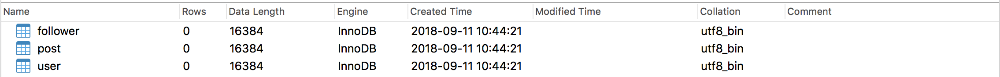
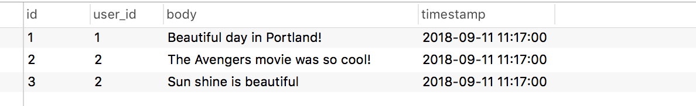
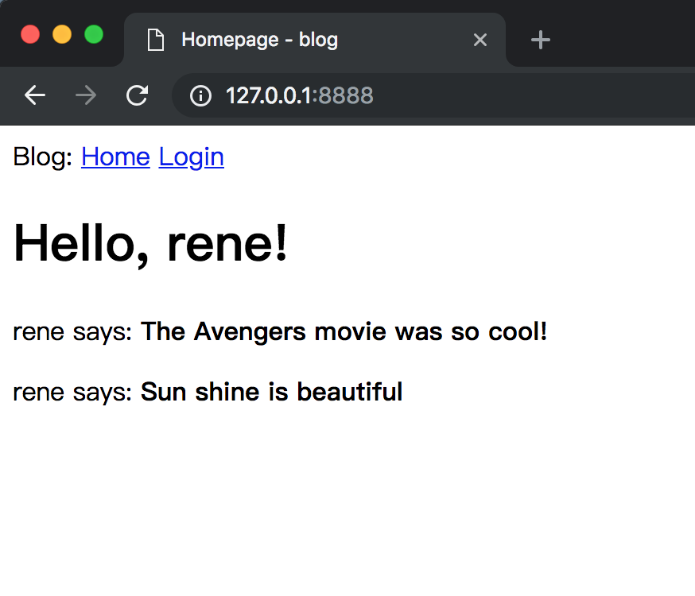

# 05-Database

本章的主题是重中之重！大多数应用都需要持久化存储数据，并高效地执行的增删查改的操作，_数据库_ 为此而生。

我们将第一次引入第三方库 [Gorm](https://github.com/jinzhu/gorm) 来帮助我们实现 ORM

_本章的GitHub链接为：_ [Source](https://github.com/bonfy/go-mega-code/tree/05-Database), [Diff](https://github.com/bonfy/go-mega-code/compare/04-Web-Form...05-Database), 
[Zip](https://github.com/bonfy/go-mega-code/archive/v0.5.zip)

## 数据库及ORM选择

数据库被划分为两大类，遵循关系模型的一类是 `关系数据库`，另外的则是 `非关系数据库`，简称 `NoSQL`，表现在它们不支持流行的关系查询语言SQL（译者注：部分人也宣称NoSQL代表不仅仅只是SQL）。这里我们打算使用的是 `mysql`, 这是一种非常流行的关系型数据库，也应该是应用最广泛的数据库了。

ORM我们选用`Gorm`, 应该是因为它的Star数遥遥领先吧。

首先我们利用下面的命令安装 `Gorm`

```cmd
go get -u github.com/jinzhu/gorm
```

## 数据库模型

定义数据库中一张表及其字段的类，通常叫做数据模型。ORM (Gorm) 会将类的实例关联到数据库表中的数据行，并翻译相关操作


id字段通常存在于所有模型并用作主键。每个用户都会被数据库分配一个id值，并存储到这个字段中。大多数情况下，主键都是数据库自动赋值的，我只需要提供id字段作为主键即可。

user表: username，email和password\_hash字段被定义为字符串（数据库术语中的VARCHAR），并指定其最大长度，以便数据库可以优化空间使用率。 username和email字段的用途不言而喻，password\_hash字段值得提一下。 我想确保我正在构建的应用采用安全最佳实践，因此我不会将用户密码明文存储在数据库中。 明文存储密码的问题是，如果数据库被攻破，攻击者就会获得密码，这对用户隐私来说可能是毁灭性的。 如果使用哈希密码，这就大大提高了安全性。 这将是另一章的主题，所以现在不需分心。

post表: 将具有必须的id、用户动态的body和timestamp字段。 除了这些预期的字段之外，我还添加了一个user\_id字段，将该用户动态链接到其作者。 你已经看到所有用户都有一个唯一的id主键， 将用户动态链接到其作者的方法是添加对用户id的引用，这正是user\_id字段所在的位置。 这个user\_id字段被称为外键。 上面的数据库图显示了外键作为该字段和它引用的表的id字段之间的链接。 这种关系被称为一对多，因为“一个”用户写了“多”条动态。

另外 我们后续还会有粉丝这种 多对多的关系


model/user.go
```go
package model

// User struct
type User struct {
    ID           int    `gorm:"primary_key"`
    Username     string `gorm:"type:varchar(64)"`
	Email        string `gorm:"type:varchar(120)"`
	PasswordHash string `gorm:"type:varchar(128)"`
    Posts        []Post
    Followers    []*User `gorm:"many2many:follower;association_jointable_foreignkey:follower_id"`
}
```
> Notice: 此处应该是`gorm:"type:varchar(64)"` 当时写的Github源码有错，不过只影响建表时的varchar size，请注意

model/post.go

```go
package model

import (
    "time"
)

// Post struct
type Post struct {
    ID        int `gorm:"primary_key"`
    UserID    int
    User      User
    Body      string     `gorm:"varchar(180)"`
    Timestamp *time.Time `sql:"DEFAULT:current_timestamp"`
}
```

model/g.go

```go
package model

import (
    "log"

    "github.com/bonfy/go-mega-code/config"
    "github.com/jinzhu/gorm"
)

var db *gorm.DB

// SetDB func
func SetDB(database *gorm.DB) {
    db = database
}

// ConnectToDB func
func ConnectToDB() *gorm.DB {
    connectingStr := config.GetMysqlConnectingString()
    log.Println("Connet to db...")
    db, err := gorm.Open("mysql", connectingStr)
    if err != nil {
        panic("Failed to connect database")
    }
    db.SingularTable(true)
    return db
}
```

其实如果作为演示项目，我们可以将`connectingStr := config.GetMysqlConnectingString()` 直接写入实际的演示数据库地址，不过为了追求和实际项目中的将配置文件单独放置的效果，我们还是将实际项目中的方法演示给大家。

多引入一个第三方package `github.com/spf13/viper`

```cmd
go get -u github.com/spf13/viper
```

设置 config 文件， `config.yml`, 可以放在项目目录下

config.yml

```yml
mysql:
  charset: utf8
  db: go-mega
  host: localhost
  password: password
  user: root
```

config/g.go

```go
package config

import (
    "fmt"

    "github.com/spf13/viper"
)

func init() {
    projectName := "go-mega"
    getConfig(projectName)
}

func getConfig(projectName string) {
    viper.SetConfigName("config") // name of config file (without extension)

    viper.AddConfigPath(".")                                                // optionally look for config in the working directory
    viper.AddConfigPath(fmt.Sprintf("$HOME/.%s", projectName))              // call multiple times to add many search paths
    viper.AddConfigPath(fmt.Sprintf("/data/docker/config/%s", projectName)) // path to look for the config file in

    err := viper.ReadInConfig() // Find and read the config file
    if err != nil {             // Handle errors reading the config file
        panic(fmt.Errorf("Fatal error config file: %s", err))
    }
}

// GetMysqlConnectingString func
func GetMysqlConnectingString() string {
    usr := viper.GetString("mysql.user")
    pwd := viper.GetString("mysql.password")
    host := viper.GetString("mysql.host")
    db := viper.GetString("mysql.db")
    charset := viper.GetString("mysql.charset")

    return fmt.Sprintf("%s:%s@tcp(%s:3306)/%s?charset=%s&parseTime=true", usr, pwd, host, db, charset)
}
```

由于 **Go** 是编译型语言，我们不能像 Python 那样可以逐行的调试演示，我们就直接编写个程序，初始化表

cmd/db\_init/main.go

```go
package main

import (
    "log"

    "github.com/bonfy/go-mega-code/model"
    _ "github.com/jinzhu/gorm/dialects/mysql"
)

func main() {
    log.Println("DB Init ...")
    db := model.ConnectToDB()
    defer db.Close()
    model.SetDB(db)

    db.DropTableIfExists(model.User{}, model.Post{})
    db.CreateTable(model.User{}, model.Post{})
}
```

我们先在mysql中创建 `go-mega` 的数据库

```
$ mysql -u root -p
输入密码后
mysql> create DATABASE go-mega;
```

然后运行

```cmd
go run cmd/db_init/main.go
```



> 本小节 [Diff](https://github.com/bonfy/go-mega-code/commit/2306009ddfbabd2f92406aa2cf233c2654e2fd7c)

## 初始化数据库数据

model/utils.go

```go
package model

import (
    "crypto/md5"
    "encoding/hex"
)

// GeneratePasswordHash : Use MD5
func GeneratePasswordHash(pwd string) string {
    hasher := md5.New()
    hasher.Write([]byte(pwd))
    pwdHash := hex.EncodeToString(hasher.Sum(nil))
    return pwdHash
}
```

model/user.go

```go
...
// SetPassword func: Set PasswordHash
func (u *User) SetPassword(password string) {
    u.PasswordHash = GeneratePasswordHash(password)
}

// CheckPassword func
func (u *User) CheckPassword(password string) bool {
    return GeneratePasswordHash(password) == u.PasswordHash
}

// GetUserByUsername func
func GetUserByUsername(username string) (*User, error) {
    var user User
    if err := db.Where("username=?", username).Find(&user).Error; err != nil {
        return nil, err
    }
    return &user, nil
}
```

model/post.go

```go
// GetPostsByUserID func
func GetPostsByUserID(id int) (*[]Post, error) {
    var posts []Post
    if err := db.Preload("User").Where("user_id=?", id).Find(&posts).Error; err != nil {
        return nil, err
    }
    return &posts, nil
}
```

cmd/db\_init/main.go

```go
package main

import (
    "log"

    "github.com/bonfy/go-mega-code/model"
    _ "github.com/jinzhu/gorm/dialects/mysql"
)

func main() {
    log.Println("DB Init ...")
    db := model.ConnectToDB()
    defer db.Close()
    model.SetDB(db)

    db.DropTableIfExists(model.User{}, model.Post{})
    db.CreateTable(model.User{}, model.Post{})

    users := []model.User{
        {
            Username:     "bonfy",
            PasswordHash: model.GeneratePasswordHash("abc123"),
            Posts: []model.Post{
                {Body: "Beautiful day in Portland!"},
            },
        },
        {
            Username:     "rene",
            PasswordHash: model.GeneratePasswordHash("abc123"),
            Email:        "rene@test.com",
            Posts: []model.Post{
                {Body: "The Avengers movie was so cool!"},
                {Body: "Sun shine is beautiful"},
            },
        },
    }

    for _, u := range users {
        db.Debug().Create(&u)
    }
}
```

运行

```cmd
$ go run cmd/db_init/main.go
```

user表
 

post表


> 本小节 [Diff](https://github.com/bonfy/go-mega-code/commit/834242739814757253916f6e2e6ef439dce96c0d)

## 完善view

现在我们的数据库里有了数据，我们就可以直接从数据库中取得数据，生成 index 的 viewmodel 了

修改 `vm/index.go` 的 GetVM func， 从数据库中获得数据

vm/index.go

```go
...
// GetVM func
func (IndexViewModelOp) GetVM() IndexViewModel {
    u1, _ := model.GetUserByUsername("rene")
    posts, _ := model.GetPostsByUserID(u1.ID)
    v := IndexViewModel{BaseViewModel{Title: "Homepage"}, *u1, *posts}
    return v
}
```

main.go

```go
package main

import (
    "net/http"

    "github.com/bonfy/go-mega-code/controller"
    "github.com/bonfy/go-mega-code/model"
    _ "github.com/jinzhu/gorm/dialects/mysql"
)

func main() {
    // Setup DB
    db := model.ConnectToDB()
    defer db.Close()
    model.SetDB(db)

    // Setup Controller
    controller.Startup()

    http.ListenAndServe(":8888", nil)
}
```

`main.go` 要初始化数据库连接，不然会报错。

另外 `import _ "github.com/jinzhu/gorm/dialects/mysql"` 确定你要使用的是 `mysql` 的 dialect

```cmd
go run main.go
```




> 本小节 [Diff](https://github.com/bonfy/go-mega-code/commit/d966fd83cd177679322c20386f4788d500ba4026)

> Notice: 由于 Gorm 的 auto migration 并不像 SQLAlchemy 那么强大，我们在使用的时候要十分小心，这里我就直接没有使用（一般项目会预先定义好数据结构，而且后期修改也可以通过SQL操作），如果有兴趣的同学可以去看下 Gorm 的文档，还是有部分的 Migration 的能力的。

## Links

  * [目录](README.md)
  * 上一节: [04-Web-Form](04-web-form.md)
  * 下一节: [06-User-Login](06-user-login.md)
