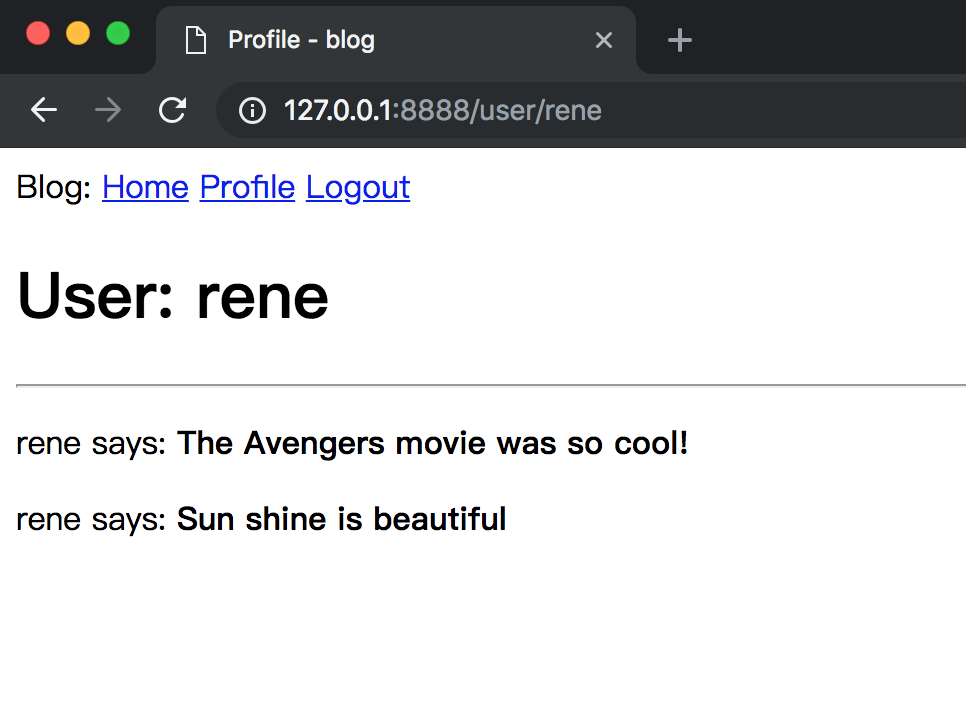
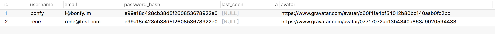
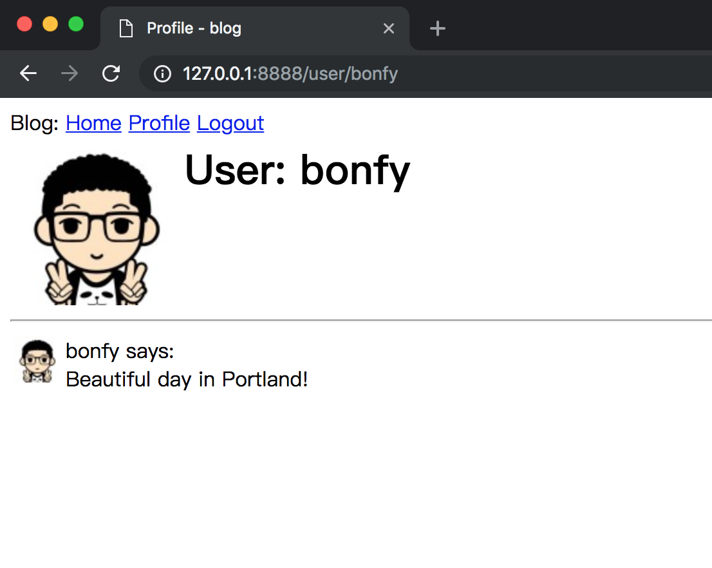
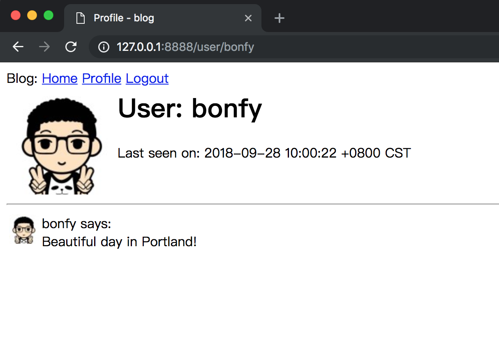
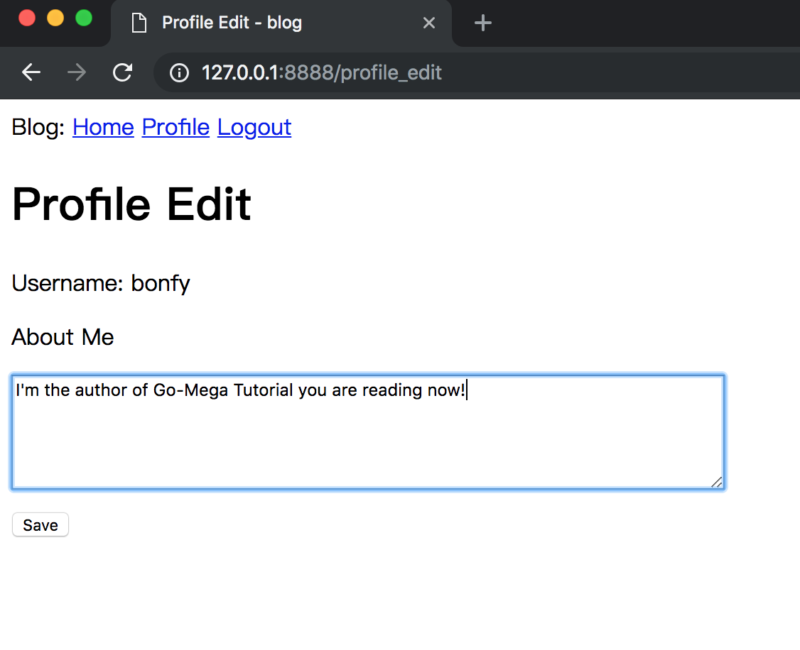
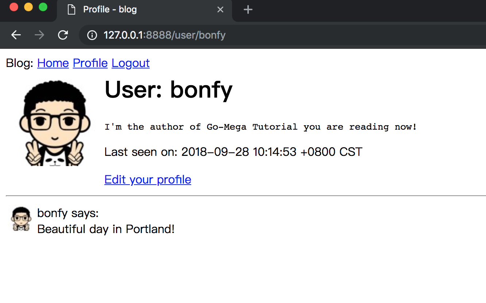

# 07-Profile Page and Avatar

本章将致力于为应用添加个人主页。个人主页用来展示用户的相关信息，其个人信息由本人录入。 我将为你展示如何动态地生成每个用户的主页，并提供一个编辑页面给他们来更新个人信息。

_本章的GitHub链接为：_ [Source](https://github.com/bonfy/go-mega-code/tree/07-Profile-Page), [Diff](https://github.com/bonfy/go-mega-code/compare/06-User-Login...07-Profile-Page), 
[Zip](https://github.com/bonfy/go-mega-code/archive/v0.7.zip)

## Profile Page

作为创建个人主页的第一步，让我们为其URL /user/ 新建一个对应的视图函数。

我们还是老套路 一个 `vm` 加一个 `page` 另外再加一个 `controller` （`model` 暂时不涉及新的model）

vm/profile.go

```go
package vm

import "github.com/bonfy/go-mega-code/model"

// ProfileViewModel struct
type ProfileViewModel struct {
	BaseViewModel
	Posts       []model.Post
	ProfileUser model.User
}

// ProfileViewModelOp struct
type ProfileViewModelOp struct{}

// GetVM func
func (ProfileViewModelOp) GetVM(sUser, pUser string) (ProfileViewModel, error) {
	v := ProfileViewModel{}
	v.SetTitle("Profile")
	u1, err := model.GetUserByUsername(pUser)
	if err != nil {
		return v, err
	}
	posts, _ := model.GetPostsByUserID(u1.ID)
	v.ProfileUser = *u1
	v.Posts = *posts
	v.SetCurrentUser(sUser)
	return v, nil
}
```

`_base.html` 在登陆情况下 加入 Profile 的链接

templates/\_base.html
```html
...
    <div>
        Blog: 
        <a href="/">Home</a>
        {{if .CurrentUser}}
        <a href="/user/{{.CurrentUser}}">Profile</a>
        <a href="/logout">Logout</a>
        {{else}}
        <a href="/login">Login</a>
        {{end}}
    </div>
...
```

templates/content/profile.html
```html
{{define "content"}}
    <h1>User: {{.ProfileUser.Username}}</h1>
    
    <hr/>

    {{range .Posts}}
    <p>
    {{ .User.Username }} says: <b>{{ .Body }}</b>
    </p>
    {{end}}
{{end}}
```

加入 profileController

controller/home.go
```go
package controller

import (
	"fmt"
	"log"
	"net/http"

	"github.com/bonfy/go-mega-code/vm"
	"github.com/gorilla/mux"
)

type home struct{}

func (h home) registerRoutes() {
	r := mux.NewRouter()
	r.HandleFunc("/logout", middleAuth(logoutHandler))
	r.HandleFunc("/login", loginHandler)
	r.HandleFunc("/register", registerHandler)
	r.HandleFunc("/user/{username}", middleAuth(profileHandler))
	r.HandleFunc("/", middleAuth(indexHandler))

	http.Handle("/", r)
}

...


func profileHandler(w http.ResponseWriter, r *http.Request) {
	tpName := "profile.html"
	vars := mux.Vars(r)
	pUser := vars["username"]
	sUser, _ := getSessionUser(r)
	vop := vm.ProfileViewModelOp{}
	v, err := vop.GetVM(sUser, pUser)
	if err != nil {
		msg := fmt.Sprintf("user ( %s ) does not exist", pUser)
		w.Write([]byte(msg))
		return
	}
	templates[tpName].Execute(w, &v)
}

...
```

这里面由于要实现 flask 那样的 `/user/username` 的效果，快速的方法是引入 `gorilla/mux` 的第三方package

```cmd
$ go get -v github.com/gorilla/mux 
```

然后注意 `registerRoutes` 函数，里面原来的 `http.handleFunc` 全部替换成 `r.handleFunc` 交给第三方的 `gorilla/mux`来处理，这样我们就可以在 handler里面使用 `mux.Vars` 来解析URL里面的`{username}`了

另外 严谨起见，这里在 profileHandler 前面加了 auth check,其实不加的话也是OK的，区别就是在登陆之前能不能查看特定 user 的 Profile

我们运行程序，登陆后点击 `Profile`的链接，就能查看到结果了。

当然你在地址栏里面直接输入 `http://127.0.0.1/user/username`如果存在，就显示 User 的 Profile,不存在就提示 `user (username) does not exist`



> 本小节 [Diff](https://github.com/bonfy/go-mega-code/commit/db97f9013662e1a3de2c029937f13b52dc9ac202)

## Avatar

我相信你也觉得我刚刚建立的个人主页非常枯燥乏味。为了使它们更加有趣，我将添加用户头像。与其在服务器上处理大量的上传图片，我将使用[Gravatar](http://gravatar.com/)为所有用户提供图片服务。

Gravatar服务使用起来非常简单。 要请求给定用户的图片，使用格式为`https://www.gravatar.com/avatar/` 的URL即可，其中 `hash` 是用户的电子邮件地址的MD5哈希值。 在下面，你可以看到如何生成电子邮件为john@example.com的用户的Gravatar URL：

如果你想看一个实际的例子，我自己的Gravatar URL是`https://www.gravatar.com/avatar/c60f4fa4bf54012b80bc140aab0fc2bc`。Gravatar返回的图片如下：


默认情况下 是 80*80 , 但可以通过向URL的查询字符串添加s参数来请求不同大小的图片。如: `https://www.gravatar.com/avatar/c60f4fa4bf54012b80bc140aab0fc2bc?s=128`

另一个可传递给Gravatar的有趣参数是d，它让Gravatar为没有向服务注册头像的用户提供的随机头像。 我最喜欢的随机头像类型是“identicon”，它为每个邮箱都返回一个漂亮且不重复的几何设计图片。 如下：


请注意，一些Web浏览器插件（如Ghostery）会屏蔽Gravatar图像，因为它们认为Automattic（Gravatar服务的所有者）可以根据你发送的获取头像的请求来判断你正在访问的网站。 如果在浏览器中看不到头像，你在排查问题的时候可以考虑以下是否在浏览器中安装了此类插件。

由于头像与用户相关联，所以将生成头像URL的逻辑添加到用户模型是有道理的。

如果你对Gravatar服务很有兴趣，可以学习他们的[文档](https://gravatar.com/site/implement/images)。

理论说好了，我们来写代码，由于 **Go** 原生的Template 不像 Jinja2 那么好支持函数（ **Go** Template 是支持自定义函数的，只是要在 template.New().Funcs() 中预先传入，与我们已有的 `PopulateTemplates`函数集成上有点难度）

所以这里发挥主观能动性，直接将 Avatar 作为字段放入数据库中，等于冗余了Avatar数据，但是减少了我们coding的难度（我们也乘此机会，fix下上次提到的Gorm format问题）

虽然我们 `GeneratePasswordHash` 就是 MD5 方法，不过为了逻辑的清晰，我们可以像下面代码这样处理。

model/utils.go
```go
package model

import (
	"crypto/md5"
	"encoding/hex"
)

// GeneratePasswordHash : Use MD5
func GeneratePasswordHash(pwd string) string {
	return Md5(pwd)
}

// Md5 func
func Md5(origin string) string {
	hasher := md5.New()
	hasher.Write([]byte(origin))
	return hex.EncodeToString(hasher.Sum(nil))
}
```

model/user.go
```go
...
// 说明: User 加入 Avatar、AboutMe、LastSeen 字段
type User struct {
	ID           int    `gorm:"primary_key"`
	Username     string `gorm:"type:varchar(64)"`
	Email        string `gorm:"type:varchar(120)"`
	PasswordHash string `gorm:"type:varchar(128)"`
	LastSeen     *time.Time
	AboutMe      string `gorm:"type:varchar(140)"`
	Avatar       string `gorm:"type:varchar(200)"`
	Posts        []Post
	Followers    []*User `gorm:"many2many:follower;association_jointable_foreignkey:follower_id"`
}
...

// 说明: 在增加User 的时候，直接设置Avatar

// SetAvatar func
func (u *User) SetAvatar(email string) {
	u.Avatar = fmt.Sprintf("https://www.gravatar.com/avatar/%s?d=identicon", Md5(email))
}

// AddUser func
func AddUser(username, password, email string) error {
	user := User{Username: username, Email: email}
	user.SetPassword(password)
	user.SetAvatar(email)
	return db.Create(&user).Error
}
...
```

cmd/db\_init/main.go
```go
package main

import (
	"fmt"
	"log"

	"github.com/bonfy/go-mega-code/model"
	_ "github.com/jinzhu/gorm/dialects/mysql"
)

func main() {
	log.Println("DB Init ...")
	db := model.ConnectToDB()
	defer db.Close()
	model.SetDB(db)

	db.DropTableIfExists(model.User{}, model.Post{})
	db.CreateTable(model.User{}, model.Post{})

	users := []model.User{
		{
			Username:     "bonfy",
			PasswordHash: model.GeneratePasswordHash("abc123"),
			Email:        "i@bonfy.im",
			Avatar:       fmt.Sprintf("https://www.gravatar.com/avatar/%s?d=identicon", model.Md5("i@bonfy.im")),
			Posts: []model.Post{
				{Body: "Beautiful day in Portland!"},
			},
		},
		{
			Username:     "rene",
			PasswordHash: model.GeneratePasswordHash("abc123"),
			Email:        "rene@test.com",
			Avatar:       fmt.Sprintf("https://www.gravatar.com/avatar/%s?d=identicon", model.Md5("rene@test.com")),
			Posts: []model.Post{
				{Body: "The Avengers movie was so cool!"},
				{Body: "Sun shine is beautiful"},
			},
		},
	}

	for _, u := range users {
		db.Debug().Create(&u)
	}
}
```

这样再运行 

```cmd
$ go run cmd/db_init/main.go
```

数据库中的数据就有了 Avatar 这个字段



现在我们再在 `profile.html`加入Avatar

这样我的个人主页的顶部有一个不错的大头像，不止如此，底下的所有用户动态都会有一个小头像。

templates/content/profile.html
```html
{{define "content"}}

    <table>
        <tr valign="top">
            <td></td>
            <td><h1>User: {{.ProfileUser.Username}}</h1></td>
        </tr>
    </table>
    
    <hr/>

    {{range .Posts}}
        <table>
            <tr valign="top">
                <td></td>
                <td>{{ .User.Username }} says:<br>{{ .Body }}</td>
            </tr>
        </table>
    {{end}}

{{end}}
```

运行程序

```cmd
$ go run main.go
```



> 本小节 [Diff](https://github.com/bonfy/go-mega-code/commit/b9549261e9d4f0e55ea9612879101d36f32ee388)

## More Info


新增的个人主页存在的一个问题是，真正显示的内容不够丰富。 用户喜欢在个人主页上展示他们的相关信息，所以我会让他们写一些自我介绍并在这里展示。 我也将跟踪每个用户最后一次访问该网站的时间，并显示在他们的个人主页上。

新字段 `last_seen` 和 `about_me` 已经在前面一起创建过了，我们只要在页面中加入就行了。

现在 `model/user.go` 中加入 `UpdateLastSeen` 函数

model/user.go
```go
...

// UpdateUserByUsername func
func UpdateUserByUsername(username string, contents map[string]interface{}) error {
	item, err := GetUserByUsername(username)
	if err != nil {
		return err
	}
	return db.Model(item).Updates(contents).Error
}

// UpdateLastSeen func
func UpdateLastSeen(username string) error {
	contents := map[string]interface{}{"last_seen": time.Now()}
	return UpdateUserByUsername(username, contents)
}
```

在 middleAuth 中，如果判断用户登陆了，就更新他的 `LastSeen` 时间 (middleAuth的用法类似于Python 里面的装饰器用法)

> Tip: 我们一般是不会在 controller 层直接和 model 层打交道，一般会通过 vm 层去处理，但是由于 middle 层不具有具体的view，我们这里破例直接调用 model 中的方法。 当然考究点，你可以建立一个 middle 的vm，在里面新建一个 UpdateLastSeen 再在 controller/middle 中调用，也是可以的


controller/middle.go
```go
package controller

import (
	"log"
	"net/http"

	"github.com/bonfy/go-mega-code/model"
)

func middleAuth(next http.HandlerFunc) http.HandlerFunc {
	return func(w http.ResponseWriter, r *http.Request) {
		username, err := getSessionUser(r)
		log.Println("middle:", username)
		if username != "" {
			log.Println("Last seen:", username)
			model.UpdateLastSeen(username)
		}
		if err != nil {
			log.Println("middle get session err and redirect to login")
			http.Redirect(w, r, "/login", http.StatusTemporaryRedirect)
		} else {
			next.ServeHTTP(w, r)
		}
	}
}

...
```

在 `profile.html` 中加入 `AboutMe` 以及 `LastSeen`

templates/content/profile.html
```html
{{define "content"}}

    <table>
        <tr valign="top">
            <td></td>
            <td>
                <h1>User: {{.ProfileUser.Username}}</h1>
                {{if .ProfileUser.AboutMe}}
                    <p>{{ .ProfileUser.AboutMe }}</p>
                {{end}}
                
                {{if .ProfileUser.LastSeen}}
                    <p>Last seen on: {{ .ProfileUser.LastSeen }}</p>
                {{end}}
            </td>
        </tr>
    </table>
    
    <hr/>

    {{range .Posts}}
        <table>
            <tr valign="top">
                <td></td>
                <td>{{ .User.Username }} says:<br>{{ .Body }}</td>
            </tr>
        </table>
    {{end}}

{{end}}

```



> 本小节 [Diff](https://github.com/bonfy/go-mega-code/commit/4e8cba8d0084e6020ded1534ab93026cf919ef14)

## Edit Profile

我还需要给用户一个表单，让他们输入一些个人资料。 表单将允许用户更改他们的用户名，并且写一些个人介绍，以存储在新的about_me字段中。 

其实细分的话分两步：

* 在`Profile`页面加入 Edit 的链接
* 增加一个 `profile_edit` 的页面

加入 Edit 链接: vm 增加 Editable 字段， 然后在 `profile.html` 中加入链接

model/profile.go
```go
package vm

import "github.com/bonfy/go-mega-code/model"

// ProfileViewModel struct
type ProfileViewModel struct {
	BaseViewModel
	Posts       []model.Post
	Editable    bool
	ProfileUser model.User
}

// ProfileViewModelOp struct
type ProfileViewModelOp struct{}

// GetVM func
func (ProfileViewModelOp) GetVM(sUser, pUser string) (ProfileViewModel, error) {
	v := ProfileViewModel{}
	v.SetTitle("Profile")
	u1, err := model.GetUserByUsername(pUser)
	if err != nil {
		return v, err
	}
	posts, _ := model.GetPostsByUserID(u1.ID)
	v.ProfileUser = *u1
	v.Editable = (sUser == pUser)
	v.Posts = *posts
	v.SetCurrentUser(sUser)
	return v, nil
}
```

templates/content/profile.html
```html
{{define "content"}}

    <table>
        <tr valign="top">
            <td></td>
            <td>
                <h1>User: {{.ProfileUser.Username}}</h1>
                {{if .ProfileUser.AboutMe}}
                    <p><pre>{{ .ProfileUser.AboutMe }}</pre></p>
                {{end}}
                
                {{if .ProfileUser.LastSeen}}
                    <p>Last seen on: {{ .ProfileUser.LastSeen }}</p>
                {{end}}

                {{if .Editable}}
                    <p><a href="/profile_edit">Edit your profile</a></p>
                {{end}}
            </td>
        </tr>
    </table>
    
    <hr/>
...
```

增加 `profile_edit` ，这个老套路

model/user.go
```go
...

// UpdateAboutMe func
func UpdateAboutMe(username, text string) error {
	contents := map[string]interface{}{"about_me": text}
	return UpdateUserByUsername(username, contents)
}
```

vm/profile_edit.go
```go
package vm

import "github.com/bonfy/go-mega-code/model"

// ProfileEditViewModel struct
type ProfileEditViewModel struct {
	LoginViewModel
	ProfileUser model.User
}

// ProfileEditViewModelOp struct
type ProfileEditViewModelOp struct{}

// GetVM func
func (ProfileEditViewModelOp) GetVM(username string) ProfileEditViewModel {

	v := ProfileEditViewModel{}
	u, _ := model.GetUserByUsername(username)
	v.SetTitle("Profile Edit")
	v.SetCurrentUser(username)
	v.ProfileUser = *u
	return v
}

// UpdateAboutMe func
func UpdateAboutMe(username, text string) error {
	return model.UpdateAboutMe(username, text)
}
```

templates/content/profile_edit.html
```html
{{define "content"}}
    <h1>Profile Edit</h1>
    <p>Username: {{.ProfileUser.Username}}</p>
    <form action="/profile_edit" method="post" name="profile_edit">
        <p>About Me</p>
        <p><textarea  name="aboutme" rows="5" cols="80" value="" placeholder="about me">{{.ProfileUser.AboutMe}}</textarea></p>
        <p><input type="submit" name="submit" value="Save"></p>
    </form>

    {{if .Errs}}
    <ul>
        {{range .Errs}}
            <li>{{.}}</li>
         {{end}}
    </ul>
    {{end}}
{{end}}
```

最后在 controller 里面加入 `profileEditHandler` 

controller/home.go
```go
...

func (h home) registerRoutes() {
	r := mux.NewRouter()
	r.HandleFunc("/logout", middleAuth(logoutHandler))
	r.HandleFunc("/login", loginHandler)
	r.HandleFunc("/register", registerHandler)
	r.HandleFunc("/user/{username}", middleAuth(profileHandler))
	r.HandleFunc("/profile_edit", middleAuth(profileEditHandler))
	r.HandleFunc("/", middleAuth(indexHandler))

	http.Handle("/", r)
}

...

func profileEditHandler(w http.ResponseWriter, r *http.Request) {
	tpName := "profile_edit.html"
	username, _ := getSessionUser(r)
	vop := vm.ProfileEditViewModelOp{}
	v := vop.GetVM(username)
	if r.Method == http.MethodGet {
		err := templates[tpName].Execute(w, &v)
		if err != nil {
			log.Println(err)
		}
	}

	if r.Method == http.MethodPost {
		r.ParseForm()
		aboutme := r.Form.Get("aboutme")
		log.Println(aboutme)
		if err := vm.UpdateAboutMe(username, aboutme); err != nil {
			log.Println("update Aboutme error:", err)
			w.Write([]byte("Error update aboutme"))
			return
		}
		http.Redirect(w, r, fmt.Sprintf("/user/%s", username), http.StatusSeeOther)
	}
}
```





> 本小节 [Diff](https://github.com/bonfy/go-mega-code/commit/a0a50dfc38c61949f065d0e02ef5bb0e89ffcdd0)

## Links

  * [目录](README.md)
  * 上一节: [06-User-Login](06-user-login.md)
  * 下一节: [08-Follower]()