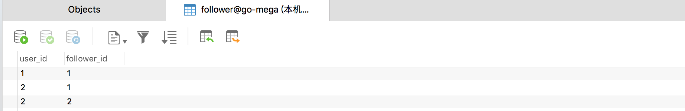
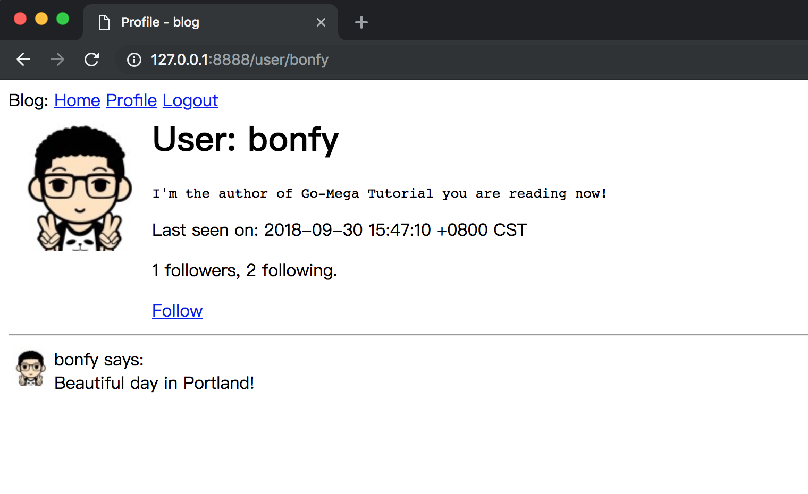

# 08-Follower

这章将告诉你如何实现类似于Twitter和其他社交网络的“粉丝”功能。

在本章中，我将更多地使用应用的数据库。 我希望应用的用户能够轻松便捷地关注其他用户。

_本章的GitHub链接为：_ [Source](https://github.com/bonfy/go-mega-code/tree/08-Follower), [Diff](https://github.com/bonfy/go-mega-code/compare/07-Profile-Page...08-Follower), 
[Zip](https://github.com/bonfy/go-mega-code/archive/v0.8.zip)

## 完善用户模型

首先我们列下要实现的用户操作:

* 关注 - Follow
* 取消关注 - UnFollow
* 关注自己 - FollowSelf
* follower数量 - FollowersCount
* following数量 - FollowingCount
* 关注的Posts - FollowingPosts 这个将被用在页面美化那章中的登陆后的IndexView显示
* 判断是否被关注 - IsFollowedByUser
* (*)创建Post - CreatePost  这个是我们为了方便创建数据加入的，和粉丝操作关系不大

>Tip: 这里 Followers 可以通过 Gorm 的 `Association("Followers")`来实现， Following 好像不支持(不确定，看了几遍文档没有找到)，不过这里我们一顿骚操作，自己来实现一下嘛

model/user.go
```go
...
// Follow func
// follow someone usr_id other.id follow_id u.id
func (u *User) Follow(username string) error {
	other, err := GetUserByUsername(username)
	if err != nil {
		return err
	}
	return db.Model(other).Association("Followers").Append(u).Error
}

// Unfollow func
func (u *User) Unfollow(username string) error {
	other, err := GetUserByUsername(username)
	if err != nil {
		return err
	}
	return db.Model(other).Association("Followers").Delete(u).Error
}

// FollowSelf func
func (u *User) FollowSelf() error {
	return db.Model(u).Association("Followers").Append(u).Error
}

// FollowersCount func
func (u *User) FollowersCount() int {
	return db.Model(u).Association("Followers").Count()
}

// FollowingIDs func
func (u *User) FollowingIDs() []int {
	var ids []int
	rows, err := db.Table("follower").Where("follower_id = ?", u.ID).Select("user_id, follower_id").Rows()
	if err != nil {
		log.Println("Counting Following error:", err)
		return ids
	}
	defer rows.Close()
	for rows.Next() {
		var id, followerID int
		rows.Scan(&id, &followerID)
		ids = append(ids, id)
	}
	return ids
}

// FollowingCount func
func (u *User) FollowingCount() int {
	ids := u.FollowingIDs()
	return len(ids)
}

// FollowingPosts func
func (u *User) FollowingPosts() (*[]Post, error) {
	var posts []Post
	ids := u.FollowingIDs()
	if err := db.Preload("User").Order("timestamp desc").Where("user_id in (?)", ids).Find(&posts).Error; err != nil {
		return nil, err
	}
	return &posts, nil
}

// IsFollowedByUser func
func (u *User) IsFollowedByUser(username string) bool {
	user, _ := GetUserByUsername(username)
	ids := user.FollowingIDs()
	for _, id := range ids {
		if u.ID == id {
			return true
		}
	}
	return false
}

// CreatePost func
func (u *User) CreatePost(body string) error {
	post := Post{Body: body, UserID: u.ID}
	return db.Create(&post).Error
}
...
```

然后在 AddUser 的时候加入 FollowSelf, 即自己关注自己，方便在显示 Profile 页的时候，展示 FollowingPosts 将自己的 Post 也列进去

model/user.go
```go
// AddUser func
func AddUser(username, password, email string) error {
	user := User{Username: username, Email: email}
	user.SetPassword(password)
	user.SetAvatar(email)
	if err := db.Create(&user).Error; err != nil {
		return err
	}
	return user.FollowSelf()
}
```

由于我们一开始的建立用户，没有加入 Follower 功能，我们重新初始化一遍数据

cmd/init\_db\main.go
```go
package main

import (
	"log"

	"github.com/bonfy/go-mega-code/model"
	_ "github.com/jinzhu/gorm/dialects/mysql"
)

func main() {
	log.Println("DB Init ...")
	db := model.ConnectToDB()
	defer db.Close()
	model.SetDB(db)

	db.DropTableIfExists(model.User{}, model.Post{}, "follower")
	db.CreateTable(model.User{}, model.Post{})

	model.AddUser("bonfy", "abc123", "i@bonfy.im")
	model.AddUser("rene", "abc123", "rene@test.com")

	u1, _ := model.GetUserByUsername("bonfy")
	u1.CreatePost("Beautiful day in Portland!")
	model.UpdateAboutMe(u1.Username, `I'm the author of Go-Mega Tutorial you are reading now!`)

	u2, _ := model.GetUserByUsername("rene")
	u2.CreatePost("The Avengers movie was so cool!")
	u2.CreatePost("Sun shine is beautiful")

	u1.Follow(u2.Username)
}
```


执行

```cmd
$ go run cmd/db_init/main.go
```

然后查看 `follower` 表，里面就有数据了



> 说明: 如上图 user_id 表示用户， follower_id 表示关注者， bonfy（id:1) 关注者 只有自己,  而 rene(id:2) 关注者 有两位, 这也是 u1.Follow(u2.Username) 的执行结果

> 本小节 [Diff](https://github.com/bonfy/go-mega-code/commit/ef4e3aaab2a4ba077edf687e6af7dc2a907df3db)

## 完善页面显示

### 增加 Follow and Unfollow 操作

controller/home.go
```go
...

func (h home) registerRoutes() {
	r := mux.NewRouter()
	r.HandleFunc("/logout", middleAuth(logoutHandler))
	r.HandleFunc("/login", loginHandler)
	r.HandleFunc("/register", registerHandler)
	r.HandleFunc("/user/{username}", middleAuth(profileHandler))
	r.HandleFunc("/follow/{username}", middleAuth(followHandler))
	r.HandleFunc("/unfollow/{username}", middleAuth(unFollowHandler))
	r.HandleFunc("/profile_edit", middleAuth(profileEditHandler))
	r.HandleFunc("/", middleAuth(indexHandler))

	http.Handle("/", r)
}

...

func followHandler(w http.ResponseWriter, r *http.Request) {
	vars := mux.Vars(r)
	pUser := vars["username"]
	sUser, _ := getSessionUser(r)

	err := vm.Follow(sUser, pUser)
	if err != nil {
		log.Println("Follow error:", err)
		w.Write([]byte("Error in Follow"))
		return
	}
	http.Redirect(w, r, fmt.Sprintf("/user/%s", pUser), http.StatusSeeOther)
}

func unFollowHandler(w http.ResponseWriter, r *http.Request) {
	vars := mux.Vars(r)
	pUser := vars["username"]
	sUser, _ := getSessionUser(r)

	err := vm.UnFollow(sUser, pUser)
	if err != nil {
		log.Println("UnFollow error:", err)
		w.Write([]byte("Error in UnFollow"))
		return
	}
	http.Redirect(w, r, fmt.Sprintf("/user/%s", pUser), http.StatusSeeOther)
}
```

`Follow` 和 `Unfollow`之后通过 Redirect 回到原来的页面

### 完善Profile页面

vm/profile.go
```go
package vm

import "github.com/bonfy/go-mega-code/model"

// ProfileViewModel struct
type ProfileViewModel struct {
	BaseViewModel
	Posts          []model.Post
	Editable       bool
	IsFollow       bool
	FollowersCount int
	FollowingCount int
	ProfileUser    model.User
}

// ProfileViewModelOp struct
type ProfileViewModelOp struct{}

// GetVM func
func (ProfileViewModelOp) GetVM(sUser, pUser string) (ProfileViewModel, error) {
	v := ProfileViewModel{}
	v.SetTitle("Profile")
	u, err := model.GetUserByUsername(pUser)
	if err != nil {
		return v, err
	}
	posts, _ := model.GetPostsByUserID(u.ID)
	v.ProfileUser = *u
	v.Editable = (sUser == pUser)

	if !v.Editable {
		v.IsFollow = u.IsFollowedByUser(sUser)
	}
	v.FollowersCount = u.FollowersCount()
	v.FollowingCount = u.FollowingCount()

	v.Posts = *posts
	v.SetCurrentUser(sUser)
	return v, nil
}

// Follow func : A follow B
func Follow(a, b string) error {
	u, err := model.GetUserByUsername(a)
	if err != nil {
		return err
	}
	return u.Follow(b)
}

// UnFollow func : A unfollow B
func UnFollow(a, b string) error {
	u, err := model.GetUserByUsername(a)
	if err != nil {
		return err
	}
	return u.Unfollow(b)
}
```

templates/content/profile.html
```html
...

	{{if .ProfileUser.LastSeen}}
		<p>Last seen on: {{ .ProfileUser.LastSeen }}</p>
	{{end}}

	<p>{{ .FollowersCount }} followers, {{ .FollowingCount }} following.</p>

	{{if .Editable}}
		<p><a href="/profile_edit">Edit your profile</a></p>
	{{else}}
		{{if .IsFollow}}
			<p><a href="/unfollow/{{.ProfileUser.Username}}">Unfollow</a></p>
		{{else}}
			<p><a href="/follow/{{.ProfileUser.Username}}">Follow</a></p>
		{{end}}
	{{end}}
...
```

运行

```cmd
$ go run main.go
```



> 说明: 这个是通过 rene 登陆之后访问 `http://127.0.0.1:8888/user/bonfy` 查看 bonfy 的profile, 由于 rene 没有 follow bonfy，可以点击 `Follow` 按钮，实现Follow操作

> 本小节 [Diff](https://github.com/bonfy/go-mega-code/commit/b1502cf92a9e1ee9f77cfa2b661646e6e4fd414c)

