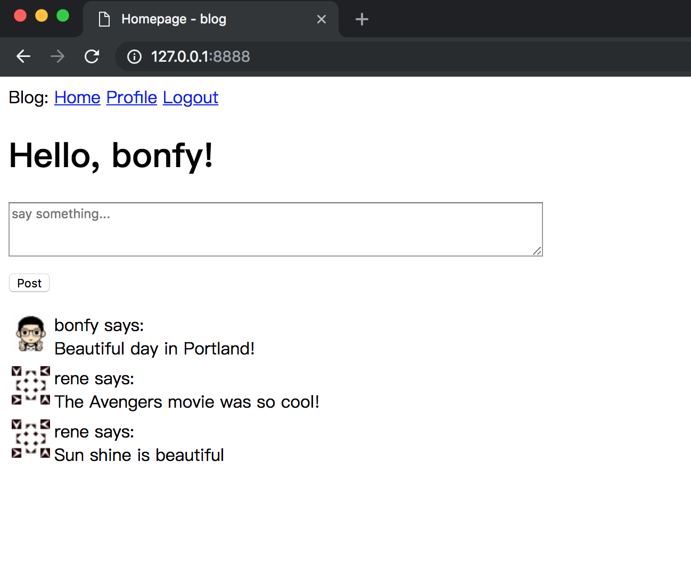
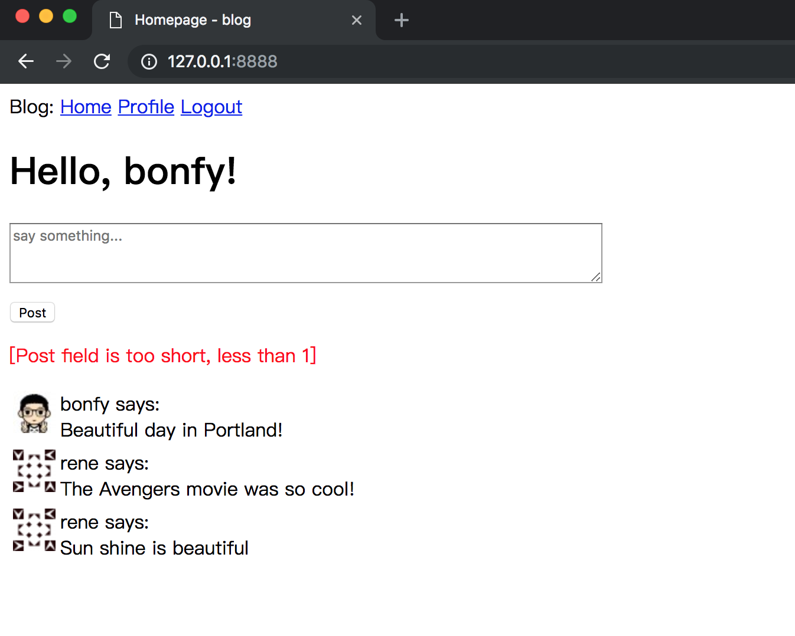
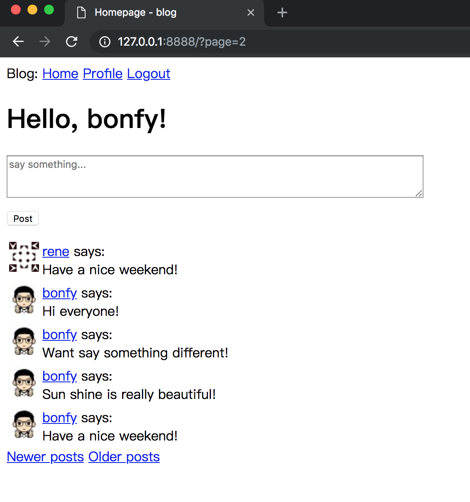
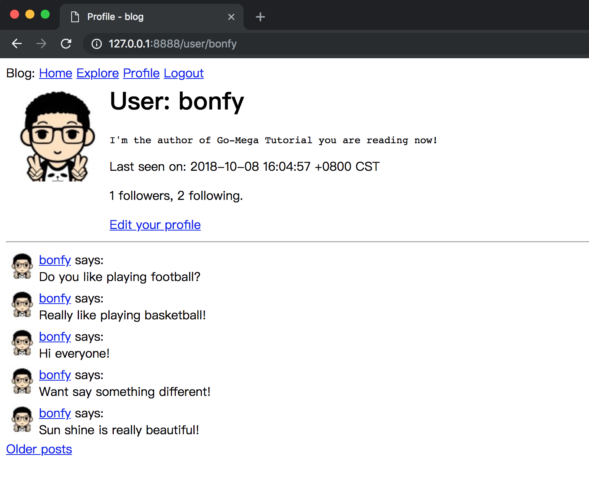
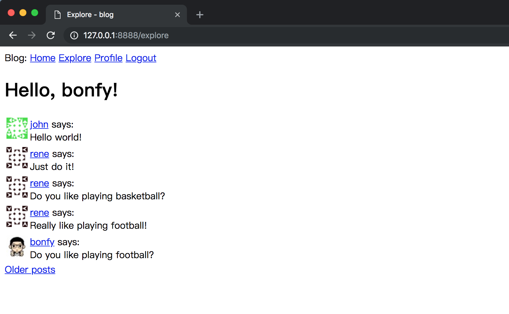

# 09-Pagination

在本章，我将告诉你如何对数据列表进行分页。

在[第八章](08-follower.md)我们支持了社交网络非常流行的“粉丝”机制。 有了这个功能，接下来我准备好删除一开始就使用的模拟用户动态了。 在本章中，应用将开始接受来自用户的动态更新，并将其发布到网站首页和个人主页。

_本章的GitHub链接为：_ [Source](https://github.com/bonfy/go-mega-code/tree/09-Pagination), [Diff](https://github.com/bonfy/go-mega-code/compare/08-Follower...09-Pagination), 
[Zip](https://github.com/bonfy/go-mega-code/archive/v0.9.zip)


## 发布用户动态

简言之，就是发布Post，首页需要有一个表单，用户可以在其中键入新动态。

不过在这之前，我们先支持下 `flash message`

controller/g.go
```go
...
var (
	homeController home
	templates      map[string]*template.Template
	sessionName    string
	flashName      string
	store          *sessions.CookieStore
)

func init() {
	templates = PopulateTemplates()
	store = sessions.NewCookieStore([]byte("something-very-secret"))
	sessionName = "go-mega"
	flashName = "go-flash"
}
...
```

controller/utils.go
```go
...

func setFlash(w http.ResponseWriter, r *http.Request, message string) {
	session, _ := store.Get(r, sessionName)
	session.AddFlash(message, flashName)
	session.Save(r, w)
}

func getFlash(w http.ResponseWriter, r *http.Request) string {
	session, _ := store.Get(r, sessionName)
	fm := session.Flashes(flashName)
	if fm == nil {
		return ""
	}
	session.Save(r, w)
	return fmt.Sprintf("%v", fm[0])
}
```

然后我们就可以使用 `flash message` 来提示 error message了

现在我们来完成发布Post功能

vm/index.go
```go
package vm

import "github.com/bonfy/go-mega-code/model"

// IndexViewModel struct
type IndexViewModel struct {
	BaseViewModel
	Posts []model.Post
	Flash string
}

// IndexViewModelOp struct
type IndexViewModelOp struct{}

// GetVM func
func (IndexViewModelOp) GetVM(username string, flash string) IndexViewModel {
	u, _ := model.GetUserByUsername(username)
	posts, _ := u.FollowingPosts()
	v := IndexViewModel{BaseViewModel{Title: "Homepage"}, *posts, flash}
	v.SetCurrentUser(username)
	return v
}

// CreatePost func
func CreatePost(username, post string) error {
	u, _ := model.GetUserByUsername(username)
	return u.CreatePost(post)
}
```

> Notice: 这里我们顺便将 IndexView 里的 Posts 改成 CurrentUser 的 FollowingPosts

templates/content/index.html
```html
{{define "content"}}
    <h1>Hello, {{.CurrentUser}}!</h1>

    <form action="/" method="post">
        
        <p><textarea  name="body" rows="3" cols="80" value="" placeholder="say something..."></textarea></p>
        <p><input type="submit" name="submit" value="Post"></p>
        
        {{ if .Flash }}
            <span style="color: red;">[{{.Flash}}]</span>
        {{ end }}
    </form>


    {{range .Posts}}
        <table>
            <tr valign="top">
                <td></td>
                <td>{{ .User.Username }} says:<br>{{ .Body }}</td>
            </tr>
        </table>
    {{end}}
{{end}}

```


controller/home.go
```go
...
func indexHandler(w http.ResponseWriter, r *http.Request) {
	tpName := "index.html"
	vop := vm.IndexViewModelOp{}
	username, _ := getSessionUser(r)
	if r.Method == http.MethodGet {
		flash := getFlash(w, r)
		v := vop.GetVM(username, flash)
		templates[tpName].Execute(w, &v)
	}
	if r.Method == http.MethodPost {
		r.ParseForm()
		body := r.Form.Get("body")
		errMessage := checkLen("Post", body, 1, 180)
		if errMessage != "" {
			setFlash(w, r, errMessage)
		} else {
			err := vm.CreatePost(username, body)
			if err != nil {
				log.Println("add Post error:", err)
				w.Write([]byte("Error insert Post in database"))
				return
			}
		}
		http.Redirect(w, r, "/", http.StatusSeeOther)
	}
}
...
```



> Notice: 这里由于我们上章初始化数据 bonfy follow了 rene，所以这里 bonfy 看到的 Index 页面中也有rene的Post,如果登陆rene的账户，是看不到bonfy的Post的，因为 rene 没有follow bonfy

我们现在在输入框中什么都不输入，直接点Post,就能看到 Flash 的 红色提示了



> 本小节 [Diff](https://github.com/bonfy/go-mega-code/commit/f1062528991817ed299dd4536bbfa2defa600c4f)

## 加入动态分页


应用看起来更完善了，但是在主页显示所有用户动态迟早会出问题。如果一个用户有成千上万条关注的用户动态时，会发生什么？你可以想象得到，管理这么大的用户动态列表将会变得相当缓慢和低效。

为了解决这个问题，我会将用户动态进行分页。这意味着一开始显示的只是所有用户动态的一部分，并提供链接来访问其余的用户动态。

我们先在 `controller/g.go` 中增加页数设置 `pageLimit` (其实更灵活点，也可以将它放入到配置文件中)

controller/g.go
```go
...
var (
	homeController home
	templates      map[string]*template.Template
	sessionName    string
	flashName      string
	store          *sessions.CookieStore
	pageLimit      int
)

func init() {
	templates = PopulateTemplates()
	store = sessions.NewCookieStore([]byte("something-very-secret"))
	sessionName = "go-mega"
	flashName = "go-flash"
	pageLimit = 5
}
...
```

接下来，我需要决定如何将页码并入到应用URL中。 一个相当常见的方法是使用查询字符串参数来指定一个可选的页码，如果没有给出则默认为页面1。 以下是一些示例网址，显示了我将如何实现这一点：

* 第1页，隐含：http://localhost:8888/
* 第1页，显式：http://localhost:8888/?page=1
* 第3页：http://localhost:8888/?page=3

要访问查询字符串中给出的参数,我们在 utils 中创建一个函数,方便以后调用 

```go
...

func getPage(r *http.Request) int {
	url := r.URL         // net/url.URL
	query := url.Query() // Values (map[string][]string)

	q := query.Get("page")
	if q == "" {
		return 1
	}

	page, err := strconv.Atoi(q)
	if err != nil {
		return 1
	}
	return page
}
```

在 vm 中建立分页的 BasePageViewModel

* PrevPage: 上一页的页码 
* NextPage: 下一页的页码
* Total: 总页数
* CurrentPage: 当前页码
* Limit: 每页显示项目数


vm/g.go
```go
...

// BasePageViewModel struct
type BasePageViewModel struct {
	PrevPage    int
	NextPage    int
	Total       int
	CurrentPage int
	Limit       int
}

// SetPrevAndNextPage func
func (v *BasePageViewModel) SetPrevAndNextPage() {
	if v.CurrentPage > 1 {
		v.PrevPage = v.CurrentPage - 1
	}

	if (v.Total-1)/v.Limit >= v.CurrentPage {
		v.NextPage = v.CurrentPage + 1
	}
}

// SetBasePageViewModel func
func (v *BasePageViewModel) SetBasePageViewModel(total, page, limit int) {
	v.Total = total
	v.CurrentPage = page
	v.Limit = limit
	v.SetPrevAndNextPage()
}

```

### 首页中的分页

model 中增加 FollowingPosts 的分页处理

model/user.go
```go
...
// FollowingPostsByPageAndLimit func
func (u *User) FollowingPostsByPageAndLimit(page, limit int) (*[]Post, int, error) {
	var total int
	var posts []Post
	offset := (page - 1) * limit
	ids := u.FollowingIDs()
	if err := db.Preload("User").Order("timestamp desc").Where("user_id in (?)", ids).Offset(offset).Limit(limit).Find(&posts).Error; err != nil {
		return nil, total, err
	}
	db.Model(&Post{}).Where("user_id in (?)", ids).Count(&total)
	return &posts, total, nil
}
...
```

index 的 vm 中加入 BasePageViewModel

vm/index.go
```go
...
type IndexViewModel struct {
	BaseViewModel
	Posts []model.Post
	Flash string

	BasePageViewModel
}

// IndexViewModelOp struct
type IndexViewModelOp struct{}

// GetVM func
func (IndexViewModelOp) GetVM(username, flash string, page, limit int) IndexViewModel {
	u, _ := model.GetUserByUsername(username)
	posts, total, _ := u.FollowingPostsByPageAndLimit(page, limit)
	v := IndexViewModel{}
	v.SetTitle("Homepage")
	v.Posts = *posts
	v.Flash = flash
	v.SetBasePageViewModel(total, page, limit)
	v.SetCurrentUser(username)
	return v
}
...
```

显示页中加入页码

templates/content/index.html
```html
...
    {{range .Posts}}
        <table>
            <tr valign="top">
                <td></td>
                <td><a href="/user/{{.User.Username}}">{{ .User.Username }}</a> says:<br>{{ .Body }}</td>
            </tr>
        </table>
    {{end}}

    {{ if gt .PrevPage 0 }}
        <a href="/?page={{.PrevPage}}">Newer posts</a>
    {{ end }}
    {{ if gt .NextPage 0 }}
        <a href="/?page={{.NextPage}}">Older posts</a>
    {{ end }}
...
```

> Notice: 这里我们顺便在 Posts显示的时候将 Username 上加了 “/user/username” 的链接,方便我们快速访问用户profile

controller修改成新的 GetVM

```go
...
func indexHandler(w http.ResponseWriter, r *http.Request) {
	tpName := "index.html"
	vop := vm.IndexViewModelOp{}
	page := getPage(r)
	username, _ := getSessionUser(r)
	if r.Method == http.MethodGet {
		flash := getFlash(w, r)
		v := vop.GetVM(username, flash, page, pageLimit)
		templates[tpName].Execute(w, &v)
	}
	if r.Method == http.MethodPost {
		r.ParseForm()
		body := r.Form.Get("body")
		errMessage := checkLen("Post", body, 1, 180)
		if errMessage != "" {
			setFlash(w, r, errMessage)
		} else {
			err := vm.CreatePost(username, body)
			if err != nil {
				log.Println("add Post error:", err)
				w.Write([]byte("Error insert Post in database"))
				return
			}
		}
		http.Redirect(w, r, "/", http.StatusSeeOther)
	}
}
...
```



### 个人主页中的分页

与首页分页类似，建立 profile 中的分页

model/post.go
```go
...
// GetPostsByUserIDPageAndLimit func
func GetPostsByUserIDPageAndLimit(id, page, limit int) (*[]Post, int, error) {
	var total int
	var posts []Post
	offset := (page - 1) * limit
	if err := db.Preload("User").Order("timestamp desc").Where("user_id=?", id).Offset(offset).Limit(limit).Find(&posts).Error; err != nil {
		return nil, total, err
	}
	db.Model(&Post{}).Where("user_id=?", id).Count(&total)
	return &posts, total, nil
}
```

vm/profile.go
```go
...
// ProfileViewModel struct
type ProfileViewModel struct {
	BaseViewModel
	Posts          []model.Post
	Editable       bool
	IsFollow       bool
	FollowersCount int
	FollowingCount int
	ProfileUser    model.User
	BasePageViewModel
}

// ProfileViewModelOp struct
type ProfileViewModelOp struct{}

// GetVM func
func (ProfileViewModelOp) GetVM(sUser, pUser string, page, limit int) (ProfileViewModel, error) {
	v := ProfileViewModel{}
	v.SetTitle("Profile")
	u, err := model.GetUserByUsername(pUser)
	if err != nil {
		return v, err
	}
	posts, total, _ := model.GetPostsByUserIDPageAndLimit(u.ID, page, limit)
	v.ProfileUser = *u
	v.Editable = (sUser == pUser)
	v.SetBasePageViewModel(total, page, limit)
	if !v.Editable {
		v.IsFollow = u.IsFollowedByUser(sUser)
	}
	v.FollowersCount = u.FollowersCount()
	v.FollowingCount = u.FollowingCount()

	v.Posts = *posts
	v.SetCurrentUser(sUser)
	return v, nil
}
...
```

templates/content/profile.html
```html
...

    {{range .Posts}}
        <table>
            <tr valign="top">
                <td></td>
                <td><a href="/user/{{.User.Username}}">{{ .User.Username }}</a> says:<br>{{ .Body }}</td>
            </tr>
        </table>
    {{end}}

    {{ if gt .PrevPage 0 }}
        <a href="/user/{{.ProfileUser.Username}}?page={{.PrevPage}}">Newer posts</a>
    {{ end }}
    {{ if gt .NextPage 0 }}
        <a href="/user/{{.ProfileUser.Username}}?page={{.NextPage}}">Older posts</a>
    {{ end }}
...
```

controller/home.go
```go
...
func profileHandler(w http.ResponseWriter, r *http.Request) {
	tpName := "profile.html"
	vars := mux.Vars(r)
	pUser := vars["username"]
	sUser, _ := getSessionUser(r)
	page := getPage(r)
	vop := vm.ProfileViewModelOp{}
	v, err := vop.GetVM(sUser, pUser, page, pageLimit)
	if err != nil {
		msg := fmt.Sprintf("user ( %s ) does not exist", pUser)
		w.Write([]byte(msg))
		return
	}
	templates[tpName].Execute(w, &v)
}
...
```



> 本小节 [Diff](https://github.com/bonfy/go-mega-code/commit/fd3c82514e78098e0f482f2be8c0797a0e6cef67)

## 更容易地发现和关注用户

相信你已经留意到了，应用没有一个很好的途径来让用户可以找到其他用户进行关注。实际上，现在根本没有办法在页面上查看到底有哪些用户存在。我将会使用少量简单的变更来解决这个问题。

我将会创建一个新的`Explore`页面。该页面看起来像是主页，但是却不是只显示已关注用户的动态，而是展示所有用户的全部动态。

我们现在导航中加入`Explore`

templates/\_base.html
```html
...
        <a href="/">Home</a>
        <a href="/explore">Explore</a>
...
```

然后增加 `Explore` 页面， 不多说了，老套路

model/post.go
```go
...
// GetPostsByPageAndLimit func
func GetPostsByPageAndLimit(page, limit int) (*[]Post, int, error) {
	var total int
	var posts []Post

	offset := (page - 1) * limit
	if err := db.Preload("User").Offset(offset).Limit(limit).Order("timestamp desc").Find(&posts).Error; err != nil {
		return nil, total, err
	}

	db.Model(&Post{}).Count(&total)

	return &posts, total, nil
}
```

vm/explore.go
```go
package vm

import "github.com/bonfy/go-mega-code/model"

// ExploreViewModel struct
type ExploreViewModel struct {
	BaseViewModel
	Posts []model.Post
	BasePageViewModel
}

// ExploreViewModelOp struct
type ExploreViewModelOp struct{}

// GetVM func
func (ExploreViewModelOp) GetVM(username string, page, limit int) ExploreViewModel {
	// posts, _ := model.GetAllPosts()
	posts, total, _ := model.GetPostsByPageAndLimit(page, limit)
	v := ExploreViewModel{}
	v.SetTitle("Explore")
	v.Posts = *posts
	v.SetBasePageViewModel(total, page, limit)
	v.SetCurrentUser(username)
	return v
}
```

templates/content/explore.html
```html
{{define "content"}}
    <h1>Hello, {{.CurrentUser}}!</h1>

    {{range .Posts}}
        <table>
            <tr valign="top">
                <td></td>
                <td><a href="/user/{{.User.Username}}">{{ .User.Username }}</a> says:<br>{{ .Body }}</td>
            </tr>
        </table>
    {{end}}

    {{ if gt .PrevPage 0 }}
        <a href="/explore?page={{.PrevPage}}">Newer posts</a>
    {{ end }}
    {{ if gt .NextPage 0 }}
        <a href="/explore?page={{.NextPage}}">Older posts</a>
    {{ end }}
{{end}}
```

controller/home.go
```go
...
func (h home) registerRoutes() {
	r := mux.NewRouter()
	r.HandleFunc("/logout", middleAuth(logoutHandler))
	r.HandleFunc("/login", loginHandler)
	r.HandleFunc("/register", registerHandler)
	r.HandleFunc("/user/{username}", middleAuth(profileHandler))
	r.HandleFunc("/follow/{username}", middleAuth(followHandler))
	r.HandleFunc("/unfollow/{username}", middleAuth(unFollowHandler))
	r.HandleFunc("/profile_edit", middleAuth(profileEditHandler))
	r.HandleFunc("/explore", middleAuth(exploreHandler))
	r.HandleFunc("/", middleAuth(indexHandler))

	http.Handle("/", r)
}

...

func exploreHandler(w http.ResponseWriter, r *http.Request) {
	tpName := "explore.html"
	vop := vm.ExploreViewModelOp{}
	username, _ := getSessionUser(r)
	page := getPage(r)
	v := vop.GetVM(username, page, pageLimit)
	templates[tpName].Execute(w, &v)
}
```

通过这些细小的变更，应用的用户体验得到了大大的提升。现在，用户可以访问发现页来查看陌生用户的动态，并通过这些用户动态来关注用户，而需要的操作仅仅是点击用户名跳转到其个人主页并点击关注链接。令人叹为观止！对吧？

此时，我建议你在应用上再次尝试一下这个功能，以便体验最后的用户接口的完善。



> 本小节 [Diff](https://github.com/bonfy/go-mega-code/commit/4609f2bd8bf293ccd2dc1871a03e7e8c91d44706)

## Links

  * [目录](README.md)
  * 上一节: [08-Follower](08-follower.md)
  * 下一节: [10-Email-Support]()