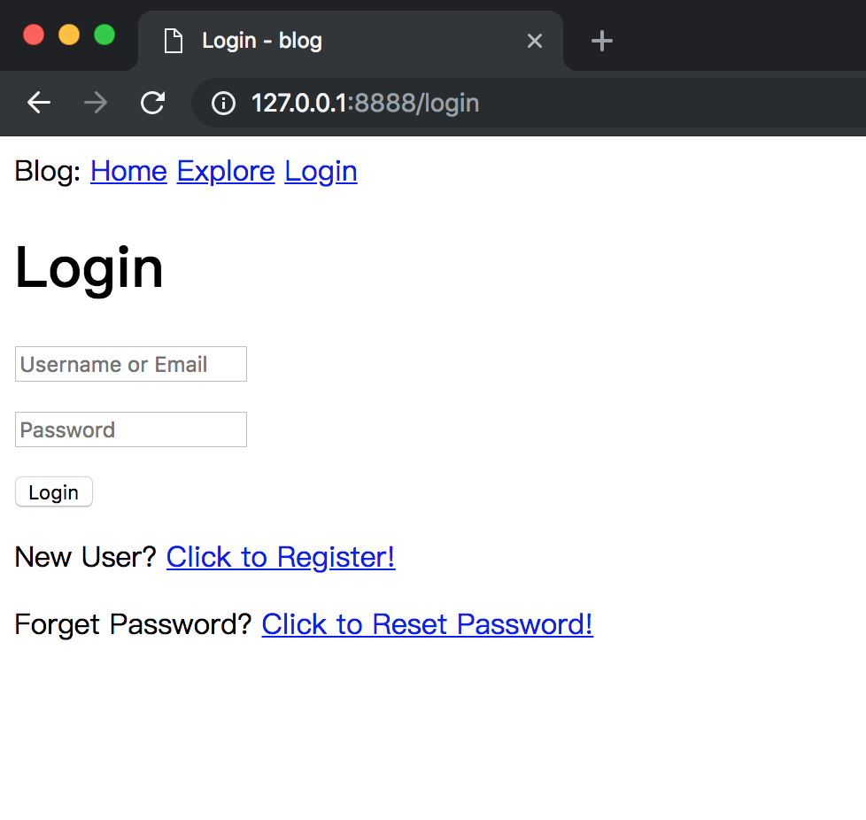
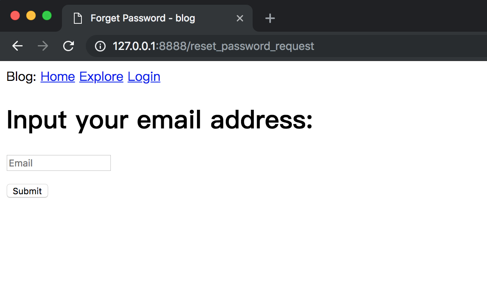
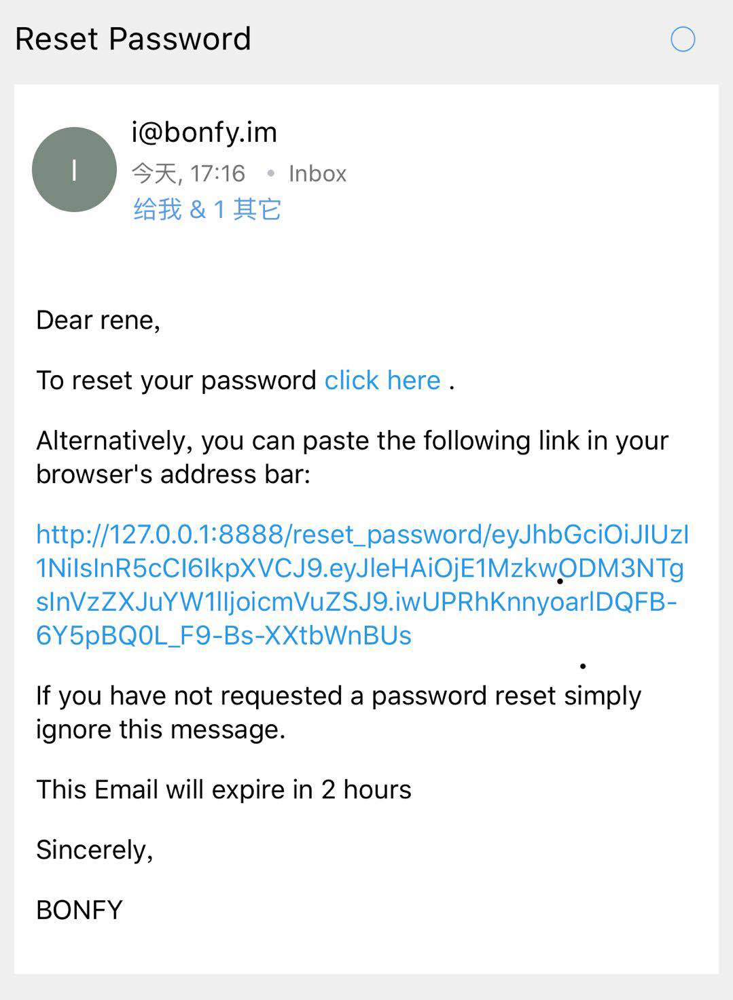
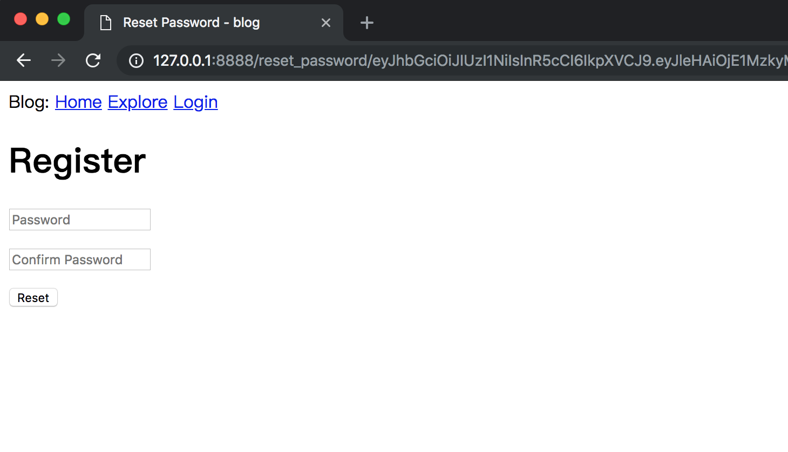

# 10-Email Support

这是Go-Mega系列的第十部分，本章我将告诉你，应用如何向你的用户发送电子邮件，以及如何在电子邮件支持之上构建密码重置功能。

现在，应用在数据库方面做得相当不错，所以在本章中，我想抛开这个主题，开始添加发送电子邮件的功能，这是大多数Web应用必需的另一个重要部分。

为什么应用需要发送电子邮件给用户？ 原因很多，但其中一个常见的原因是解决与认证相关的问题。 在本章中，我将为忘记密码的用户添加密码重置功能。 当用户请求重置密码时，应用将发送包含特制链接的电子邮件。 用户然后需要点击该链接才能访问设置新密码的表单。

_本章的GitHub链接为：_ [Source](https://github.com/bonfy/go-mega-code/tree/10-Email-Support), [Diff](https://github.com/bonfy/go-mega-code/compare/09-Pagination...10-Email-Support), [Zip](https://github.com/bonfy/go-mega-code/archive/v1.0.zip)


## 第三方库支持

本章我们需要两个第三方插件 `gomail` 以及 `jwt-go`

```cmd
# gomail
$ go get gopkg.in/gomail.v2

# jwt-go
$ go get github.com/dgrijalva/jwt-go
```

## 加入mail支持

在 config 中增加 mail 设置

config.yml
```yml
mysql:
  charset: utf8
  db: dbname
  host: localhost
  password: password
  user: root
mail:
  smtp: smtp-server
  smtp-port: 587
  user: user
  password: pwd
```

这里的 smtp server， 请查看你的邮件提供商的文档，比如 zoho mail 的 smtp 是 `smtp.zoho.com`

config/g.go
```go
...

// GetSMTPConfig func
func GetSMTPConfig() (server string, port int, user, pwd string) {
	server = viper.GetString("mail.smtp")
	port = viper.GetInt("mail.smtp-port")
	user = viper.GetString("mail.user")
	pwd = viper.GetString("mail.password")
	return
}
```

在 controller/utils.go 封装 sendMail 函数，方便调用

controller/utils.go
```go
...


// Email

// sendEmail func
func sendEmail(target, subject, content string) {
	server, port, usr, pwd := config.GetSMTPConfig()
	d := gomail.NewDialer(server, port, usr, pwd)
	d.TLSConfig = &tls.Config{InsecureSkipVerify: true}

	m := gomail.NewMessage()
	m.SetHeader("From", usr)
	m.SetHeader("To", target)
	m.SetAddressHeader("Cc", usr, "admin")
	m.SetHeader("Subject", subject)
	m.SetBody("text/html", content)

	if err := d.DialAndSend(m); err != nil {
		log.Println("Email Error:", err)
		return
	}
}
```

> 本小节 [Diff](https://github.com/bonfy/go-mega-code/commit/f741e7875dba01644c7fe60faecc76c043fffe1e)

## 请求重置密码

我上面提到过，用户有权利重置密码。因此我将在登录页面提供一个链接：

templates/content/login.html
```html
...
    <p>New User? <a href="/register">Click to Register!</a></p>
    <p>Forget Password? <a href="/reset_password_request">Click to Reset Password!</a></p>
...
```



当用户点击链接时，会出现一个新的Web表单，要求用户输入注册的电子邮件地址，以启动密码重置过程。

vm/reset_password_request.go
```go
package vm

import (
	"log"

	"github.com/bonfy/go-mega-code/model"
)

// ResetPasswordRequestViewModel struct
type ResetPasswordRequestViewModel struct {
	LoginViewModel
}

// ResetPasswordRequestViewModelOp struct
type ResetPasswordRequestViewModelOp struct{}

// GetVM func
func (ResetPasswordRequestViewModelOp) GetVM() ResetPasswordRequestViewModel {
	v := ResetPasswordRequestViewModel{}
	v.SetTitle("Forget Password")
	return v
}

// CheckEmailExist func
func CheckEmailExist(email string) bool {
	_, err := model.GetUserByEmail(email)
	if err != nil {
		log.Println("Can not find email:", email)
		return false
	}
	return true
}
```

templates/content/reset_password_request.html
```html
{{define "content"}}
    <h1>Input your email address:</h1>
    <form action="/reset_password_request" method="post" name="reset_password_request">
        <p><input type="text" class="form-control" name="email" value="" placeholder="Email"></p>
        <p><input type="submit" class="btn btn-outline-primary" name="submit" value="Submit" ></p>
    </form>

    {{if .Errs}}
    <ul>
        {{range .Errs}}
            <li>{{.}}</li>
         {{end}}
    </ul>
    {{end}}
{{end}}
```

controller/home.go
```go
...

r.HandleFunc("/reset_password_request", resetPasswordRequestHandler)
...

func resetPasswordRequestHandler(w http.ResponseWriter, r *http.Request) {
	tpName := "reset_password_request.html"
	vop := vm.ResetPasswordRequestViewModelOp{}
	v := vop.GetVM()

	if r.Method == http.MethodGet {
		templates[tpName].Execute(w, &v)
	}
	if r.Method == http.MethodPost {
		r.ParseForm()
		email := r.Form.Get("email")

		errs := checkResetPasswordRequest(email)
		v.AddError(errs...)

		if len(v.Errs) > 0 {
			templates[tpName].Execute(w, &v)

		} else {
			log.Println("Send mail to", email)
			vopEmail := vm.EmailViewModelOp{}
			vEmail := vopEmail.GetVM(email)
			var contentByte bytes.Buffer
			tpl, _ := template.ParseFiles("templates/email.html")

			if err := tpl.Execute(&contentByte, &vEmail); err != nil {
				log.Println("Get Parse Template:", err)
				w.Write([]byte("Error send email"))
				return
			}
			content := contentByte.String()
			go sendEmail(email, "Reset Password", content)
			http.Redirect(w, r, "/login", http.StatusSeeOther)
		}
	}
}
```




controller 里涉及到了 email 的template

vm/email.go
```go
package vm

import (
	"github.com/bonfy/go-mega-code/config"
	"github.com/bonfy/go-mega-code/model"
)

// EmailViewModel struct
type EmailViewModel struct {
	Username string
	Token    string
	Server   string
}

// EmailViewModelOp struct
type EmailViewModelOp struct{}

// GetVM func
func (EmailViewModelOp) GetVM(email string) EmailViewModel {
	v := EmailViewModel{}
	u, _ := model.GetUserByEmail(email)
	v.Username = u.Username
	v.Token, _ = u.GenerateToken()
	v.Server = config.GetServerURL()
	return v
}
```

templates/email.html
```html
<p>Dear {{.Username}},</p>
<p>
    To reset your password
    <a href="{{.Server}}/reset_password/{{.Token}}">
        click here
    </a>.
</p>
<p>Alternatively, you can paste the following link in your browser's address bar:</p>
<p>{{.Server}}/reset_password/{{.Token}}</p>
<p>If you have not requested a password reset simply ignore this message.</p>
<p>This Email will expire in 2 hours.</p>
<p>Sincerely,</p>
<p>BONFY</p>
```



上面简单的一封邮件，其实蕴含着两个 非常重要的 知识点：

### goroutine

原来 Flask-Mega 里面非常复杂的多线程操作，这里只用了一个 `go function()` 完成了

goroutine 可以说是 `Go` 这个语言的特色之一了，当然资料也比较多，大家可以深入了解下

这里我简单说下，就是 function 前面加个 go 关键字，就实现了 协程，用于高并发，而且性能非常好，是不是很cool！

### jwt

具体可以通过 [jwt.io](https://jwt.io/)了解下

或者中文的可以通过这片文章具体了解下 [直通车](https://juejin.im/post/5a437441f265da43294e54c3)

这里的邮件可以说是 JWT 的一个非常典型的应用场景，jwt 加密后的 URL 就是图中的一长串，其中其实隐含着 2 hour 过期时间

我们通过在 user.go 里加入两个function 就能实现, 密钥 `secret` 这里直接写在代码里，其实更优还是通过配置文件配置，又偷懒了

model/user.go
```go
...

// GenerateToken func
func (u *User) GenerateToken() (string, error) {
	token := jwt.NewWithClaims(jwt.SigningMethodHS256, jwt.MapClaims{
		"username": u.Username,
		"exp":      time.Now().Add(time.Hour * 2).Unix(), // 可以添加过期时间
	})
	return token.SignedString([]byte("secret"))
}

// CheckToken func
func CheckToken(tokenString string) (string, error) {
	token, err := jwt.Parse(tokenString, func(token *jwt.Token) (interface{}, error) {
		// Don't forget to validate the alg is what you expect:
		if _, ok := token.Method.(*jwt.SigningMethodHMAC); !ok {
			return nil, fmt.Errorf("Unexpected signing method: %v", token.Header["alg"])
		}

		// hmacSampleSecret is a []byte containing your secret, e.g. []byte("my_secret_key")
		return []byte("secret"), nil
	})

	if claims, ok := token.Claims.(jwt.MapClaims); ok && token.Valid {
		return claims["username"].(string), nil
	} else {
		return "", err
	}
}

...
```

> 本小节 [Diff](https://github.com/bonfy/go-mega-code/commit/3e6471f01981dc176ee588579aa02aae4b6ad683)

## 重置密码


目前我们点击邮件中的邮件是不能操作的，因为我们其实并没有 `/reset_password` 这个handler，那这里我们来完成它

其实密码重置就是一个简单的表单， 两个密码框，检验输入一致以及符合密码规范就可以了，操作起来不算太复杂。

vm/reset_password.go
```go
package vm

import (
	"github.com/bonfy/go-mega-code/model"
)

// ResetPasswordViewModel struct
type ResetPasswordViewModel struct {
	LoginViewModel
	Token string
}

// ResetPasswordViewModelOp struct
type ResetPasswordViewModelOp struct{}

// GetVM func
func (ResetPasswordViewModelOp) GetVM(token string) ResetPasswordViewModel {
	v := ResetPasswordViewModel{}
	v.SetTitle("Reset Password")
	v.Token = token
	return v
}

// CheckToken func
func CheckToken(tokenString string) (string, error) {
	return model.CheckToken(tokenString)
}

// ResetUserPassword func
func ResetUserPassword(username, password string) error {
	return model.UpdatePassword(username, password)
}
```

templates/content/reset_password.html

```html
{{define "content"}}
    <h1>Register</h1>
    <form action="/reset_password/{{.Token}}" method="post" name="reset_password">
        <p><input type="password" name="pwd1" value="" placeholder="Password"></p>
        <p><input type="password" name="pwd2" value="" placeholder="Confirm Password"></p>
        <p><input type="submit" name="submit" value="Reset"></p>
    </form>

    
    {{if .Errs}}
    <ul>
        {{range .Errs}}
            <li>{{.}}</li>
         {{end}}
    </ul>
    {{end}}
{{end}}
```

controller/home.go
```go
...

r.HandleFunc("/reset_password/{token}", resetPasswordHandler)

...

func resetPasswordHandler(w http.ResponseWriter, r *http.Request) {
	vars := mux.Vars(r)
	token := vars["token"]
	username, err := vm.CheckToken(token)
	if err != nil {
		w.Write([]byte("The token is no longer valid, please go to the login page."))
	}

	tpName := "reset_password.html"
	vop := vm.ResetPasswordViewModelOp{}
	v := vop.GetVM(token)

	if r.Method == http.MethodGet {
		templates[tpName].Execute(w, &v)
	}

	if r.Method == http.MethodPost {
		log.Println("Reset password for ", username)
		r.ParseForm()
		pwd1 := r.Form.Get("pwd1")
		pwd2 := r.Form.Get("pwd2")

		errs := checkResetPassword(pwd1, pwd2)
		v.AddError(errs...)

		if len(v.Errs) > 0 {
			templates[tpName].Execute(w, &v)
		} else {
			if err := vm.ResetUserPassword(username, pwd1); err != nil {
				log.Println("reset User password error:", err)
				w.Write([]byte("Error update user password in database"))
				return
			}
			http.Redirect(w, r, "/login", http.StatusSeeOther)
		}
	}
}
```




就这样我们完成了重置密码的功能，虽然设计到的页面比较多，不过只要我们思路清晰，一步一个脚印，还是能非常容易就能实现了。

现在输入新的密码，保存后，就可以用新密码登陆了。

> 本小节 [Diff](https://github.com/bonfy/go-mega-code/commit/4bc0b9304d60db854cb11b8ba5c5e908566da9a6)

> Notice: 本章还涉及到一些后端验证，在这里没有一一列举，大家还是请看下源码diff，可以更完整的了解代码

## Links

  * [目录](README.md)
  * 上一节: [09-Pagination](09-pagination.md)
  * 下一节: [11-Facelift]()