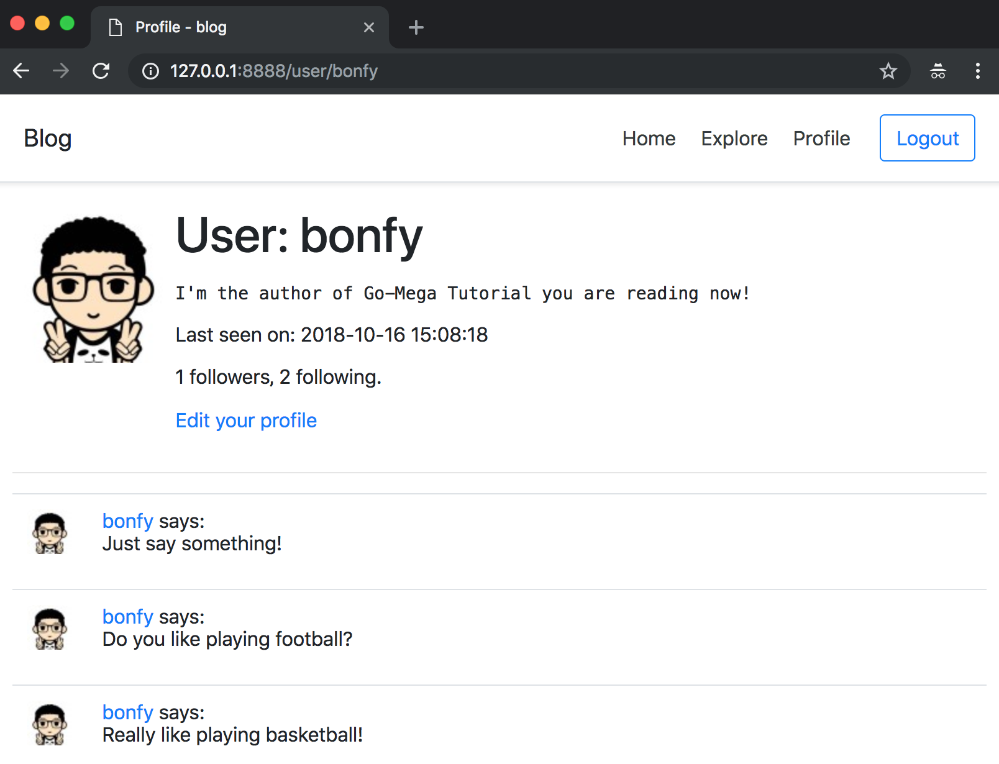
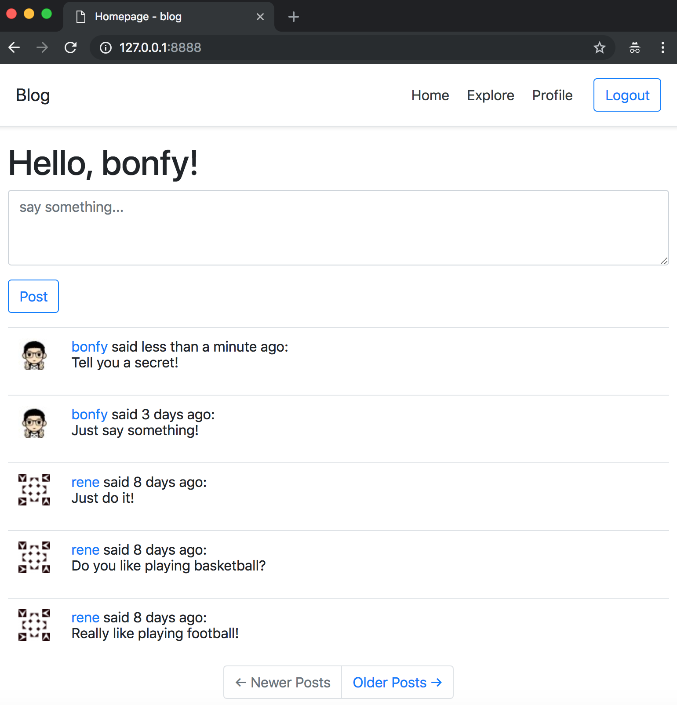

# 12-Dates and Times

在本章，我们将讨论下 **Go** 处理日期和时间的方法，以及优化 User 及 Post 对象中的时间对象

_本章的GitHub链接为：_ [Source](https://github.com/bonfy/go-mega-code/tree/12-Dates-And-Times), [Diff](https://github.com/bonfy/go-mega-code/compare/11-Facelift...12-Dates-And-Times), [Zip](https://github.com/bonfy/go-mega-code/archive/v1.2.zip)

## 优化 User 的 LastSeen

Flask-Mega 主要是用了它灵活的模板功能，以及 Moment.js 来在前端实现了时间日期的优化，与之不同，我们主要采用的是后端来实现同样的功能

model/user.go
```go
...
// FormattedLastSeen func
func (u *User) FormattedLastSeen() string {
	return u.LastSeen.Format("2006-01-02 15:04:05")
}
...
```

templates/content/profile.html
```html
...
    <p>Last seen on: {{ .ProfileUser.FormattedLastSeen }}</p>
...
```

> Notice: 虽然我也比较喜欢其他语言的 %Y-%m-%d %H:%M:%S" layout 形式，但是无奈 Go 就是 "2006-01-02 15:04:05" 这样的layout，没有道理可讲，我有时候甚至怕它搞错 01 和 02 哪个是月 哪个表示 日



> 本小节 [Diff](https://github.com/bonfy/go-mega-code/commit/01611b3d27f6c78ca6c53878502f539695d1170b)

## 优化 Post 的 Timestamp

我们目标是显示成 `user said 35 minutes ago: post message` 这样的形式，这就需要我们对时间日期进行转换

简单点，我们就在 utils.go 中实现一个 `FromTime` 函数

model/utils.go
```go
...

const (
	minute  = 1
	hour    = minute * 60
	day     = hour * 24
	month   = day * 30
	year    = day * 365
	quarter = year / 4
)

// FromDuration returns a friendly string representing an approximation of the
// given duration
func FromDuration(d time.Duration) string {
	seconds := round(d.Seconds())

	if seconds < 30 {
		return "less than a minute"
	}

	if seconds < 90 {
		return "1 minute"
	}

	minutes := div(seconds, 60)

	if minutes < 45 {
		return fmt.Sprintf("%0d minutes", minutes)
	}

	hours := div(minutes, 60)

	if minutes < day {
		return fmt.Sprintf("about %s", pluralize(hours, "hour"))
	}

	if minutes < (42 * hour) {
		return "1 day"
	}

	days := div(hours, 24)

	if minutes < (30 * day) {
		return pluralize(days, "day")
	}

	months := div(days, 30)

	if minutes < (45 * day) {
		return "about 1 month"
	}

	if minutes < (60 * day) {
		return "about 2 months"
	}

	if minutes < year {
		return pluralize(months, "month")
	}

	rem := minutes % year
	years := minutes / year

	if rem < (3 * month) {
		return fmt.Sprintf("about %s", pluralize(years, "year"))
	}
	if rem < (9 * month) {
		return fmt.Sprintf("over %s", pluralize(years, "year"))
	}

	years++
	return fmt.Sprintf("almost %s", pluralize(years, "year"))
}

// FromTime returns a friendly string representing the approximate difference
// from the given time and time.Now()
func FromTime(t time.Time) string {
	now := time.Now()

	var d time.Duration
	var suffix string

	if t.Before(now) {
		d = now.Sub(t)
		suffix = "ago"
	} else {
		d = t.Sub(now)
		suffix = "from now"
	}

	return fmt.Sprintf("%s %s", FromDuration(d), suffix)
}

func pluralize(i int, s string) string {
	var buf bytes.Buffer
	buf.WriteString(fmt.Sprintf("%d %s", i, s))
	if i != 1 {
		buf.WriteString("s")
	}
	return buf.String()
}

func round(f float64) int {
	return int(math.Floor(f + .50))
}

func div(numerator int, denominator int) int {
	rem := numerator % denominator
	result := numerator / denominator

	if rem >= (denominator / 2) {
		result++
	}

	return result
}
```

现在我们可以使用 `FromTime` 函数实现我们的功能了

model/post.go
```go
...
// FormattedTimeAgo func
func (p *Post) FormattedTimeAgo() string {
	return FromTime(*p.Timestamp)
}
...
```

templates/content/index.html & profile.html & explore.html
```html
...
    {{range .Posts}}
        <table class="table table-hover">
            <tr valign="top">
                <td width="36px"></td>
                <td><a href="/user/{{.User.Username}}">{{ .User.Username }}</a> said {{.FormattedTimeAgo}}:<br>{{ .Body }}</td>
            </tr>
        </table>
    {{end}}
...
```



> 本小节 [Diff](https://github.com/bonfy/go-mega-code/commit/b5cdcf1fec212a012486928d2bc0ad3052d37d51)


> 写在最后: 突然发现模板可以使用 类的 Function, 所以前面 User 的 Avatar 字段貌似就没有那么必要了，直接用个function来实现，而且好处是不用去关心更改邮箱后的 SetAvatar,不过我任性，就不改了，我也是才发现 Go 模板还有这个妙用的


## Links

  * [目录](README.md)
  * 上一节: [11-Facelift](11-facelift.md)
  * 下一节: [13-Javascript-Magic](13-javascript-magic.md)