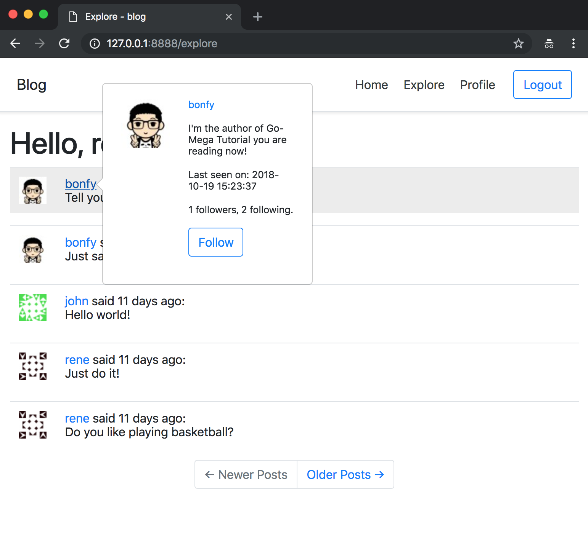

# 13-Javascript Magic

在本章，我们将添加一个功能，当你将鼠标悬停在用户的昵称上时，会弹出一个漂亮的窗口。

社交网站的常见用户交互模式是，当你将鼠标悬停在用户的名称上时，可以在弹出窗口中显示用户的主要信息。 如果你从未注意到这一点，请访问Twitter，Facebook，LinkedIn或任何其他主要社交网站，当你看到用户名时，只需将鼠标指针放在上面几秒钟即可看到弹出窗口。 本章将致力于为Microblog实现该功能。

_本章的GitHub链接为：_ [Source](https://github.com/bonfy/go-mega-code/tree/13-Javascript-Magic), [Diff](https://github.com/bonfy/go-mega-code/compare/12-Dates-And-Times...13-Javascript-Magic), [Zip](https://github.com/bonfy/go-mega-code/archive/v1.3.zip)

## 服务器端支持

在深入研究客户端之前，让我们先了解一下支持这些用户弹窗所需的服务器端的工作。 用户弹窗的内容将由新路由返回，它是现有个人主页路由的简化版本。

viewmodel 我们偷下懒，由于Popup的 vm 和 Profile 的相似，我们直接在 `vm/profile.go`中加入 GetPopupVM 来获得 Popup 的 vm

vm/profile.go
```go
...
    // GetPopupVM func
func (ProfileViewModelOp) GetPopupVM(sUser, pUser string) (ProfileViewModel, error) {
	v := ProfileViewModel{}
	v.SetTitle("Profile")
	u, err := model.GetUserByUsername(pUser)
	if err != nil {
		return v, err
	}
	v.ProfileUser = *u
	v.Editable = (sUser == pUser)
	if !v.Editable {
		v.IsFollow = u.IsFollowedByUser(sUser)
	}
	v.FollowersCount = u.FollowersCount()
	v.FollowingCount = u.FollowingCount()
	v.SetCurrentUser(sUser)
	return v, nil
}

...
```

controller/home.go
```go
...
r.HandleFunc("/user/{username}/popup", popupHandler)

...
func popupHandler(w http.ResponseWriter, r *http.Request) {
	tpName := "popup.html"
	vars := mux.Vars(r)
	pUser := vars["username"]
	sUser, _ := getSessionUser(r)
	vop := vm.ProfileViewModelOp{}
	v, err := vop.GetPopupVM(sUser, pUser)
	if err != nil {
		msg := fmt.Sprintf("user ( %s ) does not exist", pUser)
		w.Write([]byte(msg))
		return
	}
	templates[tpName].Execute(w, &v)
}

...
```

templates/content/popup.html
```html
<table>
    <tr valign="top">
        <td width="64" style="border: 0px;"></td>
        <td style="border: 0px;">
            <small>
                <p><a href="/user/{{.ProfileUser.Username}}">{{.ProfileUser.Username}}</a></p>
                {{if .ProfileUser.AboutMe}}
                    <p>{{ .ProfileUser.AboutMe }}</p>
                {{end}}
                
                {{if .ProfileUser.LastSeen}}
                    <p>Last seen on: {{ .ProfileUser.FormattedLastSeen }}</p>
                {{end}}

                <p>{{ .FollowersCount }} followers, {{ .FollowingCount }} following.</p>

                {{if .Editable}}
                    <p><a href="/profile_edit">Edit your profile</a></p>
                {{else}}
                    {{if .IsFollow}}
                        <p><a  class="btn btn-outline-primary" href="/unfollow/{{.ProfileUser.Username}}">Unfollow</a></p>
                    {{else}}
                        <p><a  class="btn btn-outline-primary" href="/follow/{{.ProfileUser.Username}}">Follow</a></p>
                    {{end}}
                {{end}}
            </small>
        </td>
    </tr>
</table>
```

当用户将鼠标指针悬停在用户名上时，随后小节中编写的JavaScript代码将会调用此路由。客户端将服务器端返回的响应中的html内容显示在弹出窗口中。 当用户移开鼠标时，弹出窗口将被删除。 听起来很简单，对吧？

如果你想了解弹窗像什么样，现在可以运行应用，跳转到任何用户的个人主页，然后在地址栏的URL中追加*/popup*以查看全屏版本的弹出窗口内容。

> 本小节 [Diff](https://github.com/bonfy/go-mega-code/commit/f48f4a33425c1a10622ab721adee43053cf96ccc)

## 客户端Ajax

我们在 \_base.html 中加入 popup 的 Ajax,这样所有继承它的页面也同样继承了 popup的功能

templates/\_base.html
```html

...
    <script src="https://cdnjs.cloudflare.com/ajax/libs/popper.js/1.14.3/umd/popper.min.js" integrity="sha384-ZMP7rVo3mIykV+2+9J3UJ46jBk0WLaUAdn689aCwoqbBJiSnjAK/l8WvCWPIPm49" crossorigin="anonymous"></script>
    <script src="https://stackpath.bootstrapcdn.com/bootstrap/4.1.3/js/bootstrap.min.js" integrity="sha384-ChfqqxuZUCnJSK3+MXmPNIyE6ZbWh2IMqE241rYiqJxyMiZ6OW/JmZQ5stwEULTy" crossorigin="anonymous"></script>
    <script>
        $(function () {
        var timer = null;
        var xhr = null;
        $('.user_popup').hover(
            function(event) {
                // mouse in event handler
                var elem = $(event.currentTarget);
                timer = setTimeout(function() {
                    timer = null;
                    xhr = $.ajax(
                        '/user/' + elem.first().text().trim() + '/popup').done(
                            function(data) {
                                xhr = null;
                                elem.popover({
                                    trigger: 'manual',
                                    html: true,
                                    animation: false,
                                    container: elem,
                                    content: data
                                }).popover('show');
                            }
                        );
                }, 1000);
            },
            function(event) {
                // mouse out event handler
                var elem = $(event.currentTarget);
                if (timer) {
                    clearTimeout(timer);
                    timer = null;
                }
                else if (xhr) {
                    xhr.abort();
                    xhr = null;
                }
                else {
                    elem.popover('hide');
                }
            }
        );
    });
    </script>

...
```

然后我们在需要有 Popup 功能的地方，就是所有的用户Post的头像地方加入 `class='user_popup'`

templates/content/index.html & explore.html & profile.html
```html
...
    <td><span class="user_popup"><a href="/user/{{.User.Username}}">{{ .User.Username }}</a></span> said {{.FormattedTimeAgo}}:<br>{{ .Body }}</td>
...
```



> 本小节 [Diff](https://github.com/bonfy/go-mega-code/commit/8259a0b1347ea5aeab1b6b7351b88d147ce3c01b)

## Links

  * [目录](README.md)
  * 上一节: [12-Dates-And-Times](12-dates-and-times.md)
  * 下一节: [14]()