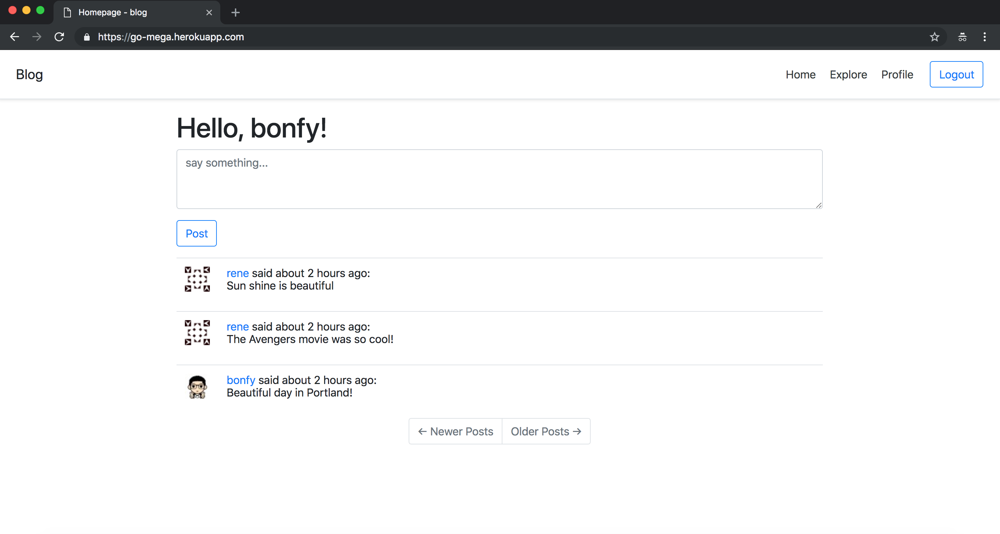

# 14-Deployment On Heroku

在本章，我会将应用部署到Heroku云平台

许多云托管提供商提供了一个应用程序可以运行的托管平台。 你只需提供部署到这些平台上的实际应用程序，因为硬件，操作系统，脚本语言解释器，数据库等都由该服务管理。 这种服务称为平台即服务（PaaS）。

[Heroku](https://www.heroku.com/),这是一种流行的云托管服务,对Python、Go、Nodejs等应用程序支持都很好,关键还免费,而且默认支持HTTPS

_本章的GitHub链接为：_ [Source](https://github.com/bonfy/go-mega-code/tree/14-Deployment-On-Heroku), [Diff](https://github.com/bonfy/go-mega-code/compare/13-Javascript-Magic...14-Deployment-On-Heroku), [Zip](https://github.com/bonfy/go-mega-code/archive/v1.4.zip)


## Heroku

Heroku 是首批PaaS平台之一。 它以Ruby的应用程序的托管服务开始，随后逐渐发展到支持诸多其他语言，如Java，Node.js，Python 还有Go。

在 Heroku 中部署Web应用程序主要是通过git版本控制工具完成的，因此你必须将应用程序放在git代码库中。 在通过git将应用程序上传到 Heroku 的服务器之后，你的工作基本就完成了，只需等待几秒钟，应用程序就会上线。 整个操作流程就是这么简单。

Heroku提供不同的服务级别，允许你自主选择为应用程序提供多少计算能力和运行时间，随着用户群的增长，你需要购买更多的“dynos”计算单元。

## 创建Heroku账户

在部署应用到 Heroku 之前，你需要拥有一个帐户。 所以请访问 `heroku.com` 并创建一个免费账户。 一旦注册成功并登录到 Heroku，你将可以访问一个dashboard，其中列出了你的所有应用程序。

## 安装Heroku命令行工具

我们可以在 Heroku 的 dashboard 上完成所有操作，不过还有个更简便的方法，就是安装Heroku cli 工具

```cmd
$ brew install heroku
```

然后我们可以通过命令行来登陆 Heroku 

```cmd
$ heroku login
```

## 创建Heroku应用

要用Heroku注册一个新应用，需要在应用程序根目录下使用`apps:create`子命令，并将应用程序名称作为唯一参数传递：


```cmd
$ heroku apps:create go-mega
Creating ⬢ go-mega... done
https://go-mega.herokuapp.com/ | https://git.heroku.com/go-mega.git
```

## 创建 Heroku 数据库

Heroku 只有Postgres数据库是免费的，Mysql是收费的，所以我们还是创建 Postgres 数据库

```cmd
$ heroku addons:add heroku-postgresql:hobby-dev
Creating heroku-postgresql:hobby-dev on ⬢ go-mega... free
Database has been created and is available
 ! This database is empty. If upgrading, you can transfer
 ! data from another database with pg:copy
Created postgresql-angular-82467 as DATABASE_URL
Use heroku addons:docs heroku-postgresql to view documentation
```

## 初始化数据

```cmd
$ heroku config
=== go-mega Config Vars
DATABASE_URL: ******************
```

#### 针对Heroku做些代码优化

由于Heroku采用的是 Configvar 的设置环境变量的方式，而且我们把 config.yml git ignore了，所以加入 `os.Getenv` 的方式去获取Configvar的环境变量，包括 DBTYPE, EMAIL相关，以及Heroku postgres 提供的 DATABASE_URL 

config/g.go
```go
package config

import (
	"fmt"
	"log"
	"os"
	"strconv"

	"github.com/spf13/viper"
)

func init() {
	projectName := "go-mega"
	dbType := GetDBType()
	log.Println("OS DBTYPE:", dbType)

	if IsHeroku() {
		log.Println("Get Env from os.env")
	} else {
		log.Println("Init viper")
		getConfig(projectName)
	}
}

func getConfig(projectName string) {
	viper.SetConfigName("config") // name of config file (without extension)

	viper.AddConfigPath(".")                                                // optionally look for config in the working directory
	viper.AddConfigPath(fmt.Sprintf("$HOME/.%s", projectName))              // call multiple times to add many search paths
	viper.AddConfigPath(fmt.Sprintf("/data/docker/config/%s", projectName)) // path to look for the config file in

	err := viper.ReadInConfig() // Find and read the config file
	if err != nil {             // Handle errors reading the config file
		panic(fmt.Errorf("Fatal error config file: %s", err))
	}
}

// GetMysqlConnectingString func
func GetMysqlConnectingString() string {
	usr := viper.GetString("mysql.user")
	pwd := viper.GetString("mysql.password")
	host := viper.GetString("mysql.host")
	db := viper.GetString("mysql.db")
	charset := viper.GetString("mysql.charset")

	return fmt.Sprintf("%s:%s@tcp(%s:3306)/%s?charset=%s&parseTime=true&loc=Local", usr, pwd, host, db, charset)
}

// GetHerokuConnectingString func
func GetHerokuConnectingString() string {
	return os.Getenv("DATABASE_URL")
}

// GetSMTPConfig func
func GetSMTPConfig() (server string, port int, user, pwd string) {
	if IsHeroku() {
		server = os.Getenv("MAIL_SMTP")
		port, _ = strconv.Atoi(os.Getenv("MAIL_SMTP_PORT"))
		user = os.Getenv("MAIL_USER")
		pwd = os.Getenv("MAIL_PASSWORD")
		return
	}

	server = viper.GetString("mail.smtp")
	port = viper.GetInt("mail.smtp-port")
	user = viper.GetString("mail.user")
	pwd = viper.GetString("mail.password")
	return
}

// GetServerURL func
func GetServerURL() (url string) {
	if IsHeroku() {
		url = os.Getenv("SERVER_URL")
		return
	}
	url = viper.GetString("server.url")
	return
}

// GetDBType func
func GetDBType() string {
	dbtype := os.Getenv("DBTYPE")
	return dbtype
}

// IsHeroku func
func IsHeroku() bool {
	return GetDBType() == "heroku"
}
```

修改ConnectToDB函数，支持postgres的数据库形式

model/g.go
```go
...

// ConnectToDB func
func ConnectToDB() *gorm.DB {
	if config.IsHeroku() {
		return ConnectToDBByDBType("postgres", config.GetHerokuConnectingString())
	}
	return ConnectToDBByDBType("mysql", config.GetMysqlConnectingString())
}

// ConnectToDBByDBType func
func ConnectToDBByDBType(dbtype, connectingStr string) *gorm.DB {
	log.Println("DB Type:", dbtype, "\nConnet to db...")
	db, err := gorm.Open(dbtype, connectingStr)
	if err != nil {
		panic("Failed to connect database")
	}
	db.SingularTable(true)
	return db
}
```

cmd/db_init/main.go
```go
    ...
    _ "github.com/jinzhu/gorm/dialects/postgres"
    ...
```

main.go 与数据初始化无关，不过最后部署还是要做响应的调整

main.go
```go
    ...
    _ "github.com/jinzhu/gorm/dialects/postgres"
    ...
    
    
    port := os.Getenv("PORT")
	log.Println("Running on port: ", port)
	http.ListenAndServe(":"+port, context.ClearHandler(http.DefaultServeMux))
```

### 数据init

```cmd
$ export DATABASE_URL=postgres://xxxxxxx
$ export DBTYPE=heroku

$ go run cmd/db_init/main.go
```

然后我们会发现数据初始化就完成了，让我们确认下

```cmd
# 安装 psql
$ brew install postgresql

$ heroku pg:psql 
$ DATABASE=> select * from post;
id | user_id |              body               |           timestamp
----+---------+---------------------------------+-------------------------------
  1 |       1 | Beautiful day in Portland!      | 2018-10-23 07:13:30.664214+00
  2 |       2 | The Avengers movie was so cool! | 2018-10-23 07:13:36.118051+00
  3 |       2 | Sun shine is beautiful          | 2018-10-23 07:13:38.502164+00

# 退出
$ DATABASE=> \q
```

> 本小节 [Diff](https://github.com/bonfy/go-mega-code/commit/43cd0173a5c698b191e42e2c4b244645be01ddd7)


## 部署 Heroku

### 设置Config Vars

可以访问 [https://dashboard.heroku.com/apps/go-mega/settings](https://dashboard.heroku.com/apps/go-mega/settings) dashboard 的Config Vars 进行设置

也可以通过heroku cli

```cmd
$ heroku config:set DBTYPE=heroku

# 设置root url
$ heroku config:set SERVER_URL=https://go-mega.herokuapp.com

# 设置mail
$ heroku config:set MAIL_SMTP=smtp.zoho.com
$ heroku config:set MAIL_SMTP_PORT=587
$ heroku config:set MAIL_USER=your_username
$ heroku config:set MAIL_PASSWORD=your_password

# 查看config
$ heroku config
```

### Procfile

Procfile
```
web: go-mega-code
```

现在我们可以通过 `heroku local`来在本地查看应用

```cmd
$ heroku local
```

### Go dep

目前我们的代码和配置都已经完成了，不过部署 heroku 还需要我们提供依赖，我们这里使用 `Godep`

可以参照[Go Dependencies via Godep](https://devcenter.heroku.com/articles/go-dependencies-via-godep)

```cmd
$ go get -u github.com/tools/godep
$ godep save ./...

# 结果可以看见多了两个文件夹: vendor/ 和 Godeps/
```

### Push heroku

```cmd
# Remote add heroku
$ heroku git:remote -a go-mega
set git remote heroku to https://git.heroku.com/go-mega.git
$ git remote -v
heroku	https://git.heroku.com/go-mega.git (fetch)
heroku	https://git.heroku.com/go-mega.git (push)
origin	git@github.com:bonfy/go-mega-code.git (fetch)
origin	git@github.com:bonfy/go-mega-code.git (push)

# push branch to heroku master
$ git push heroku 14-Deployment-On-Heroku:master
```


现在访问 [https://go-mega.herokuapp.com/](https://go-mega.herokuapp.com/) 就能看见 Demo 了



> 本小节 [Diff](https://github.com/bonfy/go-mega-code/commit/6dd19e4cd7e692e28bc1a091318b1d2a8a6126f7)

## Links

  * [目录](README.md)
  * 上一节: [13-Javascript-Magic](13-javascript-magic.md)
  * 下一节: [15]()